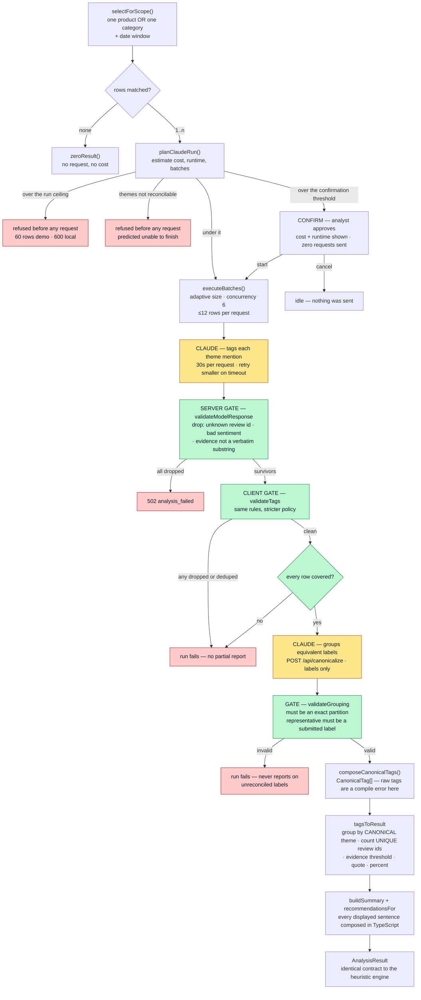

# ReviewIQ

## About

Built by Amina Moufakkir as a project for the
[Pursuit](https://www.pursuit.org) **AI-Native Program**.

**Live demo (GitHub Pages, heuristic) → https://amina-moufakkir.github.io/ReviewIQ/**

**Live demo (Vercel, heuristic) → https://reviewiq-six.vercel.app/**

Both public URLs run the **heuristic engine only**. They are static as far as
analysis is concerned: the Claude path is compiled out of the bundle, and the two
serverless routes are deployed but keyless and switched off, answering a
controlled `503 analysis_disabled` to anyone who calls them directly.

> **The Claude engine is not on either public URL.** It runs on a separate,
> access-controlled preview deployment, because it spends money on every run.
> There is no public link to it by design — see
> [The two deployments](#the-two-deployments) for why, and
> [External access on Hobby](#external-access-on-hobby) for how it is
> demonstrated.

> The public demo uses a small **synthetic Amazon-style dataset**, so the full
> integration can be explored without redistributing the original data. Local
> developers can download the real dataset and run `npm run build:amazon` to
> replace it. See [Getting the dataset](#getting-the-dataset).

## In short

ReviewIQ helps E-commerce Analysts understand customer feedback fast: it turns
raw reviews into a structured product brief — what customers praise, what they
fault, the recurring themes, and what to do next — with every claim backed by
counts and a real quote from the selected rows.

It runs **two interchangeable analysis engines** — a deterministic heuristic one
and a Claude-powered semantic one — behind a single `analyzeReviews()` contract,
over **three data sources**: a real Amazon product dataset, a synthetic review
sample, and any CSV you upload. Those sources do not share a data model — an
Amazon row is a product record, a sample row is one customer's review — so the
engineering problem the project actually solves is holding one loader, one
contract and one UI steady while the shape of the underlying data changes.

## Problem

Customer insights are buried in thousands of reviews. Analysts spend hours reading and summarizing feedback before they can answer business questions.

## MVP

The core MVP is complete. An analyst can:

- Use the **real Amazon product dataset** (the default), the built-in sample,
  load the bundled 204-review sample, or **upload a CSV** — either a ReviewIQ
  review CSV or a raw Amazon product export, recognized by its header
- Analyze **one product, or one whole category** — categories are grouped on the
  top-level category value, so an analyst can ask a question about electronics
  rather than about 490 products one at a time
- Select a date range (for datasets that carry review dates)
- Run the analysis
- View a structured brief: overall summary, what customers praise, what they
  fault, recurring themes, and recommended actions
- See a **discounts & promotions** breakdown when the data supports it —
  how promoted purchases compare with full-price ones on average rating

Every insight — findings, mention counts, percentages, representative quotes,
and the summary — is derived only from the rows inside the selected product
and, where the data carries review dates, the selected date range. The Amazon
dataset has no dates, so a run there covers every product record for the chosen
product.

## Two data models, one contract

ReviewIQ deliberately supports two kinds of row, and names them differently
rather than forcing one vocabulary over both:

- **Review datasets** (the built-in sample, the 204-review sample, an uploaded
  review CSV) are analyzed **review-by-review**: one row is one customer's
  review, with that customer's own star rating and, usually, a date.
- **Amazon datasets** (the bundled dataset, or an uploaded Amazon export) are
  analyzed **record-by-record**: one row is a product listing that already
  aggregates many customers — a product-average rating and roughly eight
  customers' review text concatenated into a single cell, with no date anywhere
  in the source.

Either model can arrive by upload: the [CSV upload](#csv-upload) control reads
the file's header and routes it to the matching loader, so the model follows the
data rather than the button it came through.

The distinction is load-bearing, not cosmetic. It decides the noun the UI uses
("1,464 product records", never "1,464 reviews"), whether the date window is
shown at all, and how much a percentage is really claiming. `unitFor()` in
`src/lib/datasetInfo.ts` is the single place that decision is made; everything
downstream reads it. See [What one row actually is](#what-one-row-actually-is)
for what this costs analytically.

## Product or category scope

An analyst's question is often not about one product. *"What are customers
complaining about most in electronics this month?"* is a **category** question,
and answering it by opening 490 products one at a time is exactly the manual
reading this tool exists to remove.

So a run is scoped to **either one product or one whole category**. Category
scope is additive — product analysis is unchanged, and both go through the same
`analyzeReviews()` contract and return the same `AnalysisResult`.

**The grouping key is the top-level category.** Amazon ships a pipe hierarchy
(`Home&Kitchen|HomeDecor|Lighting`); sample and uploaded CSVs ship a flat value
(`Electronics`). A flat value is a hierarchy of length one, so one rule serves
both: the key is the outermost segment (`src/lib/categoryKey.ts`), settled once
in the loader and stored as `Product.topCategory`.

Grouping on the *leaf* would be useless — the real dataset has **207 leaves**
like `FanHeaters` and `HDMICables`, against **9 top-level categories**. Most
leaves hold a single product.

**Counts follow the unit, not the scope.** Widening the selection changes which
rows are read, never what a row is:

| Data | A category is | The brief counts |
| --- | --- | --- |
| Review data | many products × many reviews | reviews — "5 of 11 selected reviews" |
| Amazon data | many products, each one aggregated record | product records — "237 of 526" |

The per-unit evidence threshold still applies, the date window is still shown
only for data that carries dates, and the findings header states the scope so a
category name is never mistaken for a product name.

**Under the Claude engine, a whole category is analyzed in batches** rather than
in one request — a category is often large, and three of the nine Amazon
categories hold 447–526 records, covering 1,426 of the 1,464 rows. The batching
is invisible: the analyst picks a category, and the counts, percentages and
quotes describe every row in it.

**What is still refused is refused before anything is sent**, and never
truncated. A selection over `MAX_ROWS_PER_ANALYSIS` (60 on the protected demo,
600 locally), or one the estimator projects cannot have its themes reconciled,
returns a controlled message naming the real count and the ceiling and offering
only remedies that exist for that query. A partial answer would look like a
complete one, so there is no partial answer — at any stage.

The heuristic engine has no ceiling at all, so category scope works there over
any size, which is what both public demos run. See
[Which engine for which data](#which-engine-for-which-data) and
[Cost, limits, and how spend is bounded](#cost-limits-and-how-spend-is-bounded).

## CSV upload

Upload a CSV and ReviewIQ analyzes it in place — no backend, nothing sent to a
server. **One control accepts both supported shapes**, and the file's own header
decides how it is read:

| Your file's header carries | It loads as | One row is |
| --- | --- | --- |
| `review_id`, `product_id`, `product_name`, `category`, `rating`, `review_text` | a **ReviewIQ review CSV** | one customer's review |
| `product_id`, `product_name`, `category`, `rating`, `review_content` | an **Amazon product export** | one product record |

So a raw Amazon export — the 16-column source file, unmodified — can be dropped
straight into the upload control, and it loads exactly as the bundled Amazon
dataset does: product records, undated, counted and worded as records
(1,465 parsed → 1,464 accepted → 1,350 products, for the full source file).
There is no separate Amazon upload button, and no need to run
`npm run build:amazon` first — that script exists to make the dataset the app's
*default* source, not to make it uploadable.

Detection reads column names only — no value sniffing, no filename heuristics —
so two files with the same header always load the same way. A file that carries
both `review_text` and `review_content` is read as the ReviewIQ shape, which
keeps per-customer rows per-customer. A file matching neither is rejected with a
message naming what each shape is missing, rather than a guess:

> This CSV matches neither supported format. As a ReviewIQ review CSV it is
> missing review_id, review_text; as an Amazon product export it is missing
> review_content.

Both routes converge on the same loader, so validation, skip reasons and the
parsed/accepted/skipped accounting are identical either way
(`src/lib/loadUploadedCsv.ts`).

### Review-CSV columns

Required: `review_id`, `product_id`, `product_name`, `category`, `rating` (1–5),
`review_text`. Optional: `review_date`, `review_title`, `verified_purchase`,
`country`, `promotion`, `discount_percent`. See
[`public/sample-reviews.csv`](public/sample-reviews.csv) for the exact format.

`review_date` is the one optional column that changes how the dataset behaves:

- **Present** — every row must hold a valid calendar date (`YYYY-MM-DD`). Rows
  with a **strictly-invalid** one (e.g. `2026-02-30`, `2026-13-01`, or a blank
  cell) are skipped and counted, and the date range auto-fits the data.
- **Absent** — the file is treated as **undated**. Every row loads with no date
  and the date window is hidden rather than shown empty; a run covers every row
  for the chosen product. This is how the Amazon dataset loads.

Rows with an out-of-range rating or a duplicate id are skipped and counted
either way.

Parsing is entirely in the browser: the file itself is never uploaded anywhere,
under either engine. The heuristic engine then analyzes it in the browser too,
so nothing leaves the page at all. The Claude engine sends the **filtered**
reviews — the selected product, and the date window when the data has one — to
`/api/analyze`; see [Security model](#security-model).

## How the analysis works

ReviewIQ has **two analysis engines** behind a single async boundary,
`analyzeReviews()` in `src/services/analyzeReviews.ts`. The UI and the
`AnalysisResult` contract are identical no matter which engine runs — only
the engine that produces the tags changes. Selection is by configuration
(`VITE_ANALYSIS_ENGINE`), not a user-facing toggle.

The heuristic engine was built **first, on purpose**: it is explainable,
testable, free to run, and deterministic, so the whole product — filtering,
evidence, thresholds, quotes, UI — could be proven correct without a model in
the loop. The Claude engine was added behind the same boundary afterwards.
[Why the second engine exists](#why-the-second-engine-exists) is where the
interesting part is: the Amazon dataset makes the difference between them
measurable rather than theoretical.

No backend, database, or accounts are required for either engine's data: rows
come from the Amazon fixture, the built-in sample, or a CSV you provide, and are
parsed entirely in the browser.

### Which engine for which data

ReviewIQ chooses its sentiment method by the **shape of the data**, because the
two are not interchangeable.

**Rating-based sentiment (heuristic engine)** infers praise/fault from the star
rating. It is fast, free, deterministic and offline — it powers the GitHub Pages
demo, which has no server to call — and it is a good approximation whenever a
review's overall verdict matches its parts.

Its limit is **structural, not a matter of tuning**. Polarity is read from the
review's rating and applied to every theme that review mentions
(`mentioning.filter(r => r.rating >= 4)`), so a single review cannot split: it is
all praise or all fault. A review that likes one aspect and dislikes another is
therefore misfiled, and the built-in sample already contains such reviews:

> 2★ *"Kept dropping connection during video calls. When it works the sound is
> genuinely good."* — Sound quality and Connectivity are **both** filed as
> faults, though the sound is explicitly praised.

> 4★ *"Delicious espresso and easy to froth milk. Cleaning takes effort but the
> results are worth it."* — Coffee quality and Cleaning are **both** filed as
> praise, though Cleaning is the complaint.

A second blind spot follows from the same design: keyword matching has no notion
of negation, so *"no problems with the battery"* inside a low-rated review counts
as battery-fault evidence.

So the accuracy claim is bounded. On per-review data the engine is right about
most reviews, because most reviews are not mixed, and wrong about the mixed ones
in proportion to how many there are. On product-average data it fails
completely — one "review" is thousands of customers at once, and a single star
value describes none of them individually.

**Text-based sentiment (Claude engine)** reads the review body and assigns
sentiment **per theme mention**, which is the difference that matters: one review
can yield praise for one theme and a fault for another, because each mention is
judged on its own words rather than inheriting a verdict from the row. That is
the case the rating-based engine cannot represent at all.

It is required for data where the rating does NOT track individual reviews — the
Amazon dataset, whose rating is a product-AVERAGE over thousands of customers.
There a rating-based engine goes blind: a complaint written inside a 4- or
5-star review, or inside an averaged 3-star record, is invisible to it. The
Claude engine surfaces it because it reads the words. The average rating is shown
only as CONTEXT in the header — labelled an averaged product rating — and never
determines sentiment. It is not sent to the model at all.

A worked example, `7SEVEN Compatible LG TV Remote` (`B09F6D21BY`), one product
record whose average is 3.0★. The heuristic engine returns no praise and no
faults: a rounded 3 is neither ≥ 4 nor ≤ 2, so no text in that record can
produce a finding. The record actually reads:

> The mouse feature of the remote is not working … no voice recognition and no
> ray pointer … would like a refund for misrepresentation on the website …
> Number buttons are not working, Defective product, it is not working with the
> tv …

The Claude engine surfaces those as faults, each quoted verbatim from that text.

**The rule:** match the engine to the data shape, and know what each costs.
Rating-based sentiment is a reasonable approximation when one rating stands for
one review's whole text, and it buys determinism, zero cost and offline
operation for the price of getting mixed reviews wrong. When the rating stands
for an average of many, that price becomes the whole answer: derive sentiment
from the text and demote the rating to displayed context. The `analyzeReviews()`
boundary lets both engines coexist so the right one runs for the right data.

**Where it runs, and where it does not.** The Claude engine runs in local
`vercel dev` and on a separate, **access-controlled Preview deployment**. It is
**not enabled on the public production deployment**, which runs heuristic-only:
the production bundle is built without `VITE_ANALYSIS_ENGINE=claude`, so the
Claude path and its `/api/analyze` call are tree-shaken out of the shipped
JavaScript entirely — verified against the deployed artifact, not merely assumed
from an unset variable. That deployment also cannot reach the real dataset — `.vercelignore`
excludes `public/amazon-products.csv`, because its redistribution terms are
unverified and `src/amazon.csv` additionally carries real reviewer ids and
names — so it falls back to the synthetic `amazon-demo.csv`. The live site
therefore demonstrates the rating-based engine over synthetic product records;
the text-based engine over real ones is a local capability. The UI states which
engine produced any given result rather than leaving a reader to assume.

**This is a settled decision, not a gap.** The live site stays heuristic-only
and the Claude engine stays a locally verified capability. Three things drove it:
the per-analysis API cost; the real dataset's unverified redistribution terms and
reviewer PII, which keep it out of deployments regardless of engine; and an
`/api/analyze` that has no authentication and would be publicly reachable through
the production alias. `ANTHROPIC_API_KEY` is therefore set in **no** Vercel
environment, and the deployed endpoint answers `500 server_misconfigured` by
design — see [Environment variables](#environment-variables).

Read an empty Vercel environment as the decision working, not as something to
repair.

**Determinism is the trade-off.** The heuristic engine is fully deterministic —
identical input yields identical output — which is what makes it reproducible,
unit-testable, and safe to assert on in CI. The Claude engine's theme
*clustering* varies between runs. The same complaints surface and the quotes
stay verbatim, but the model may group equivalent mentions into a different
number of named themes, so per-theme counts are not reproducible run to run the
way the heuristic engine's are.

Observed on `B09F6D21BY`, same text, three runs: 7 faults / 2 praise, then
5 faults / 3 praise, then 7 faults / 3 praise — the second run merged "ray
pointer missing" and "voice recognition" into one theme. Every quote was an
exact substring of the review text in all three runs.

Grounding is unaffected by this, and that is the point: what varies is how
findings are *named and grouped*, never whether they trace to words a customer
actually wrote. The evidence check in `claudeTags.ts` is a code-level gate, not
a model instruction, so it holds regardless of how the model clusters. This
variance is a property of using a language model, not a defect to engineer away
— no temperature or seed tuning is applied to suppress it. Assert on grounding
in tests, not on theme counts.

### Engine 1 — Heuristic (default, no backend, fully static)

A deterministic, rating-assisted engine (`src/services/analysisEngine.ts`)
that runs entirely in the browser with no API calls. It:

- **detects themes** by whole-word / bounded-phrase keyword matching against a
  shared vocabulary (`src/services/themeLibrary.ts`, `src/lib/matchKeyword.ts`),
  so `cleaner teeth` does not trigger `Cleaning`;
- **decides sentiment from the star rating** — ≥ 4 is praise, ≤ 2 is a fault,
  3 is neutral;
- only surfaces a theme once enough same-polarity rows support it, and always
  attaches a real supporting quote. **How many rows is "enough" depends on what
  a row is** (`minEvidenceFor`): **two** for review data, because the threshold
  exists to stop one customer's passing remark becoming a theme — but **one**
  for product records, because a single record already bundles roughly eight
  customers behind a rating averaged over thousands. Requiring two records would
  require the same product to be listed twice on the marketplace, which is a
  property of marketplace listings, not of evidence. A product-level finding
  therefore claims the theme is *mentioned* in that record, and the UI says
  "Themes mentioned" rather than "Recurring themes", and omits the percentage
  when there is only one row (1 of 1 is 100%, which reads as unanimity);
- adds a **discounts & promotions** breakdown (`src/services/promotionAnalysis.ts`)
  when the reviews carry promotion data — comparing promoted vs full-price
  purchases on average rating; datasets without it simply omit the section.

Each finding's percentage is that theme's supporting rows as a share of the rows
in the selected product and window ("N of M selected reviews · P%", or "product
records" for undated product-level data such as the Amazon dataset).
Because it needs no server, this engine powers the static **GitHub Pages demo**,
and it is deterministic — the same input always produces the same output.

### Engine 2 — Claude (semantic, server-side)

A Claude-powered engine that understands the actual language of the reviews
rather than matching a fixed keyword list. It:

- identifies themes from the reviews' own wording and clusters semantically
  equivalent phrasings under one canonical label (e.g. "died after a week",
  "won't hold a charge", "battery's useless" → one battery-life theme);
- assigns sentiment from the **review text**, per theme mention — so a 4-star
  review that contains a real complaint is correctly counted as a fault;
- returns only structured tags; **all counts, percentages, and quotes are still
  computed in TypeScript from the real reviews** — never taken from model prose.

So the summary sentence and every number are computed in code under **both**
engines; what the Claude engine changes is *how themes and per-mention sentiment
are detected* (language understanding vs. a fixed keyword list + star rating).

#### The pipeline

The model is the only nondeterministic component in the system, and it is
sandwiched between deterministic validation and deterministic assembly. It
proposes; code disposes.

A selection is **not** sent as one request. Benchmarking showed that could not
reach category scale — see [Why batching](#why-batching). The pipeline splits it
into bounded batches, tags each one, reconciles the theme labels those
independent batches produced, and only then computes anything.



Properties worth reading off the diagram:

- **The rating never reaches the model.** It is absent from every request, so
  sentiment cannot be influenced by it — a structural guarantee rather than an
  instruction the prompt asks the model to follow.
- **The evidence check is a code gate, not a prompt rule.** Theme naming and
  clustering vary between runs; whether a claim is allowed to appear does not.
- **The second gate is stricter than the first by design.** The server is
  lenient toward an untrusted model — it keeps valid tags and discards bad ones.
  The client trusts the server, so *any* rejection there means a version
  mismatch or a tampered response, and the whole run fails rather than rendering
  a partial report.
- **Grouping sees labels, never review text.** `/api/canonicalize` has no field
  for text, and a label longer than 120 characters is refused — so "labels only"
  is enforced by the contract rather than by convention.
- **Only an exact partition leaves the grouping gate.** Every label covered once,
  no invented names. Anything else fails the run, because reporting on
  unreconciled labels would under-count every theme two batches happened to name
  differently while looking finished.
- **`CanonicalTag` cannot be forged.** It and `ValidatedTag` are structurally
  incompatible in both directions, so passing raw per-batch tags into final
  aggregation is a compile error rather than a silent under-count.
- **Four branches exit before any request is sent** — no rows, over the run
  ceiling, themes predicted unreconcilable, or a declined confirmation. All cost
  nothing.

#### Why batching

A single synchronous request could not reach category scale, and the reason is
arithmetic rather than tuning. Measured throughput is ~110 output tokens/second,
so a 30-second window admits ~3,300 output tokens; a 526-row category needs
~212,000 — more than the model's own 128k output ceiling. Measured on 2026-08-02
([`bench/DECISION.md`](bench/DECISION.md)): 5 dense rows completed in ~19s, while
10 rows, 20 rows, and the entire synthetic demo category all hit the wall.

So the pipeline splits the work. Batch size is not fixed: the planner seeds an
estimate from text density, then sizes each subsequent batch from an EWMA of
**measured** output tokens per row, halving on a timeout or truncation and
growing at most 1.5x at a time. Requests run six at a time, capped at 12 rows
each — the limit the server enforces independently.

The design was written up before it was built, and the reasoning behind each
choice — bounded batching, grounded per-batch tagging, deterministic
aggregation, cross-batch canonicalization, and controlled failure — is in
[`docs/adr/0001-category-scale-claude-analysis.md`](docs/adr/0001-category-scale-claude-analysis.md).
It is a design record rather than current documentation: where the two differ,
this README and the code are authoritative.

Independent batches name things independently, which is why grouping exists:
batch 3's "battery life" and batch 47's "poor battery" are one concept wearing
two labels, and aggregating them separately would split one theme's support in
two. In the acceptance gate this was not hypothetical — three separately-worded
labels for one Bluetooth complaint each had a single supporting review, and all
three would have fallen below the evidence threshold and vanished. Merged, they
are a real finding at 3 of 11 reviews. See [`bench/GATE.md`](bench/GATE.md).

**A known limitation, unresolved.** Grouping is not deterministic. The same
category failed once and succeeded once in the acceptance gate, at 169 labels
against a 300-label limit and a longest label of 40 characters against a limit of
120 — nothing near a boundary either time. The failure rate is not characterised.
It is a *terminal, visible* failure that produces no partial or fragmented
report, and the endpoint records the exact cause; but it is real and it is
recorded rather than resolved.

#### The run lifecycle

Because a category run can take minutes and cost real money, the interface asks
before it starts, reports what it is doing, and can be stopped.

```
idle ── analyze() ──► plan
                       ├─ refuse   ──► error        (0 requests)
                       ├─ confirm  ──► confirming   (0 requests)
                       └─ go       ──► running

confirming ── start ──►  running        (only the current plan may start)
confirming ── cancel ──► idle           (0 requests, selection preserved)

running ── progress ──► running         (forward only)
running ── done ─────►  success | empty
running ── cancel ───►  cancelled
running ── failure ──►  error
```

| Status | Report shown | Copy Report | Controls | Cancel |
| --- | --- | --- | --- | --- |
| `idle` | — | — | enabled | — |
| `confirming` | — | — | **locked** | dialog Cancel |
| `running` | — | — | **locked** | Claude only |
| `success` | yes | **available** | enabled | — |
| `empty` | — | — | enabled | — |
| `cancelled` | — | — | enabled | — |
| `error` | — | — | enabled | — |

- **Confirmation is a decision, not a progress step.** The planner returns
  "confirm" *instead of* starting, so reaching that state is itself the
  guarantee that nothing has been dispatched. The same planner runs inside the
  engine, so a run the dialog offers is one the engine would accept, and an
  unconfirmed costly run called directly is still refused.
- **Progress counts rows, never requests.** Adaptive sizing means the eventual
  request count is unknown mid-run, so a percentage built on it would slide
  backwards as the planner resizes. Row totals are fixed when the run starts.
  Updates that would move backwards are ignored rather than clamped into
  something plausible, which would hide a defect rather than surface it.
- **Cancellation produces no report**, is distinct from failure, and applies only
  to the active run — a click landing after a run finishes cannot erase a report
  already on screen.
- **The heuristic engine has none of this.** It is pure, synchronous and
  in-browser: nothing to confirm, no stage to report, nothing to abort. It shows
  a plain working message rather than a fabricated row counter.

### Why the second engine exists

On ordinary review data the two engines are close: one row is one customer with
one opinion and one star rating, so deriving sentiment from the rating is a
reasonable approximation and the heuristic engine produces a useful brief.

The Amazon dataset is where that approximation breaks, and it breaks
*measurably*. Each row's rating is a product **average** over thousands of
customers, so it regresses toward the middle: across the 1,464 accepted records,
1,422 round to ≥ 4 and exactly **2** round to ≤ 2. The heuristic engine reads
sentiment from that number, so it has almost no fault evidence to find — the
"what they fault" column comes back near-empty not because the products have no
problems, but because averaging destroyed the signal the engine depends on. The
complaints are still there, in the text, in the same rows.

The Claude engine reads that text, and assigns sentiment per theme *mention*
rather than per row, so a record whose rounded rating says 4 can still yield a
fault. **The dataset itself is the argument for semantic analysis** — not a
preference for models over rules, but a data shape a rating-based heuristic
structurally cannot answer, whatever its keyword list. Swapping the source is
what exposed it, which is precisely why both engines sit behind one contract.

(The heuristic half of that comparison is measured — 1,422 vs 2 is counted
directly from the accepted records. The Claude half is a property of how the
engine assigns sentiment, verified end-to-end on review data; a fixed evaluation
set on the Amazon data is the benchmark still deferred below.)

### Security model

The Claude call runs **server-side only**, in a Vercel serverless function at
`api/analyze.ts`. The `ANTHROPIC_API_KEY` is read only via `process.env` inside
that function — it is never bundled into the browser and never prefixed `VITE_`.
The key is set on **exactly one** Vercel target — Preview, scoped to the
`claude-demo` branch — and on **no Production target**, so public production
answers a controlled `503 analysis_disabled` rather than running. A separate key
lives in a local `.env.local` for `vercel dev`. See
[Environment variables](#environment-variables) and
[Where this is verified, and where it is not](#which-engine-for-which-data) for
why the live endpoint is intentionally keyless. The browser sends the filtered
reviews to `/api/analyze` and receives back validated tags or a controlled error.

### Selecting an engine

Set `VITE_ANALYSIS_ENGINE` in the environment:

| Value       | Engine    | Where it runs                        |
| ----------- | --------- | ------------------------------------ |
| `heuristic` | Engine 1  | Browser only (GitHub Pages demo)     |
| `claude`    | Engine 2  | Vercel (`api/analyze.ts`) + browser  |

> **Note:** the `claude` row describes where the engine runs *when enabled*. It
> is enabled in local `vercel dev` and on the protected Preview deployment —
> never on **public production**, which ships heuristic-only with no key. See
> [How the deployments coexist](#how-the-deployments-coexist).

`VITE_ANALYSIS_ENGINE` carries only the engine name — it is **not** a secret and
contains no key. When Claude mode is selected and the call fails, the app
surfaces a controlled error; it does **not** silently fall back to the heuristic
engine.

For the Claude engine's endpoint behavior, request limits, secret configuration,
`vercel dev`, deployment, and cost, see
[Claude engine & Vercel deployment](#claude-engine--vercel-deployment) below.

## Amazon dataset (the default data source)

On load, ReviewIQ analyzes the **Amazon Sales Dataset** — approximately 1,465
real Amazon product listings. It is fetched at runtime from
`public/amazon-products.csv`, parsed by the same RFC 4180 parser and validated
by the same loader as any uploaded CSV, and adapted by
`src/lib/amazonAdapter.ts`.

> **The real dataset is not committed to this repository — you supply it
> locally.** Nothing derived from it is redistributed here, on purpose. See
> [Source, license and attribution](#source-license-and-attribution) for why,
> and [Getting the dataset](#getting-the-dataset) for how to supply it.

**The Amazon source resolves in this order:**

1. `public/amazon-products.csv` — the real dataset, generated locally by
   `npm run build:amazon`.
2. `public/amazon-demo.csv` — a committed, fully **synthetic** stand-in in the
   same column shape. This is what deployed builds get.

The fallback is deliberately to synthetic *Amazon-shaped* data and never to the
ordinary review sample: someone exploring the Amazon path should actually be
exercising the Amazon adapter, not a different dataset wearing its name. The
label reads "Amazon demo records (synthetic)" and the app states in place that
the records are invented, so the two can never be confused. The built-in sample
and CSV upload remain separately selectable either way.

Everything the integration does stays visible on the demo data: the adapter
runs, records are undated, the wording says *product records*, the long-title
selector shortening applies, and the parsed/accepted/skipped accounting has real
skips to show.

### Source, license and attribution

The dataset is the **Amazon Sales Dataset** by KARKAVELRAJA J, published on
Kaggle at
<https://www.kaggle.com/datasets/karkavelrajaj/amazon-sales-dataset>, where it
is tagged **CC BY-NC-SA 4.0**. Approximately 1,465 product listings; this
repository's figures (1,465 parsed → 1,464 accepted → 1,350 products) come from
that file.

**Nothing derived from it is redistributed here** — not the raw file, not the
generated fixture, not an excerpt. That is deliberate, and it is stricter than
the tag alone would require.

The reason is that a Kaggle license tag is chosen by the **uploader**, and an
uploader can only license rights they hold. The review text here was written by
Amazon customers, and Amazon's terms restrict scraping and redistribution of
site content, so the tag governs at most the uploader's compilation — it cannot
grant rights over the underlying reviews. Rather than decide how far it reaches,
this project treats redistribution as not permitted and never tests the
question. ShareAlike never triggers, because SA applies to *distributing* an
adaptation and no adaptation is distributed. The non-commercial term is likewise
never exercised.

Attribution is given anyway, because published **results** are derived from the
data even though the data is not published: record counts, the rating
distribution, and the worked example in
[Why the second engine exists](#why-the-second-engine-exists).

Independently of licensing, the raw file carries **real reviewer ids and names**
— see [Getting the dataset](#getting-the-dataset) for the counts and for what
the generator strips. That is a privacy constraint, not a license one, and it
would apply even under a permissive license.

*This is a description of the project's own policy, not legal advice.*

### Why the deployed build ships synthetic data

The synthetic dataset is a **design decision, not a fallback of last resort**.

The constraint was identified first: the data cannot be redistributed and
carries personal identifiers. The available responses were to drop the Amazon
integration, to deploy a crippled version of it, or to build a stand-in that
exercises the identical code path. The third was chosen, so
`public/amazon-demo.csv` is invented from scratch **in the source's exact column
shape** — which is why the deployed demo still runs the real adapter, still
produces undated product records, still says *product records* rather than
*reviews*, and still has genuine skips in its load accounting.

The boundary is enforced mechanically rather than by convention, because a rule
that depends on remembering it is not a rule:

| Mechanism | What it stops |
| --- | --- |
| `.gitignore` | the raw file and the generated fixture entering the repository |
| `.vercelignore` | either file reaching a deployment via a **CLI** `vercel deploy`, which uploads the working directory rather than the git tree. Git-triggered deployments build from the repository, where `.gitignore` already excludes both files — so this is defence in depth for the CLI path, not the primary control |
| `scripts/build-amazon-csv.mjs` | reviewer ids and names surviving into the generated fixture |

The two are labelled differently wherever they appear. The demo dataset loads as
"Amazon demo records (synthetic)" and the app states in place that the records
are invented, so a visitor cannot mistake generated text for customer feedback.

The cost is honest and worth stating: the deployed demo cannot demonstrate the
finding that motivates the second engine, because that finding needs real
reviews. The README carries it instead, with the numbers.

### What one row actually is

**One row is a product record, not a customer review.** Each row is a product
listing that carries a product-average rating and the review text of roughly
eight customers concatenated into a single cell. Everything the app reports
about this dataset therefore counts *product records*, and the UI says so —
it never labels them "reviews".

### Load accounting

| | |
| --- | --- |
| Parsed records | 1,465 |
| Accepted | 1,464 |
| Skipped | 1 (`invalid_rating` — one row whose `rating` cell is `\|`) |
| Products derived | 1,350 |

The app shows the first three verbatim: *1,465 parsed · 1,464 accepted · 1
skipped (invalid rating 1)*, above *Using Amazon product records · 1,464 product
records · 1,350 products*.

**Why 1,465 rows become 1,350 products.** Rows and products are not the same
count, for two independent reasons:

1. The 1,465 parsed rows carry **1,351 distinct `product_id`s**. 92 of those ids
   appear on more than one row, with differing prices, rating counts and text.
   Rows are never deduplicated; a product is derived from the **first** accepted
   row per id, so repeated ids collapse to one product each.
2. One row is skipped (`rating` cell is `|`). Its `product_id` appears on **no
   other row**, so that id is lost with it — leaving **1,350 distinct ids across
   the 1,464 accepted rows**, and therefore 1,350 products.

So: 1,351 distinct ids − 1 id whose only row was invalid = 1,350 products; the
92 repeated ids explain the gap between 1,464 accepted rows and 1,350 products,
not the 1,351/1,350 difference. (The 92 figure is the same before and after the
skip.)

`accepted + skipped = parsed` always holds, every skip is attributed to a
reason, and both numbers are shown in the app. No row is discarded silently.

### Mapping

| Amazon column | ReviewIQ field | Transformation |
| --- | --- | --- |
| `product_id` | `Review.productId`, `Product.id` | trimmed |
| `product_name` | `Product.name` | trimmed |
| `category` | `Product.category`, `Review.category` | `\|` hierarchy split; leaf used, full path preserved in `AmazonRecord.categoryPath` |
| `review_content` | `Review.text` | **verbatim — never split on commas** |
| `rating` | `Review.rating` + `Review.sourceRating` | rounded to an integer; source decimal preserved |
| *(none)* | `Review.date` | `""` — the dataset has no dates and none are invented |
| *(synthetic)* | `Review.id` | positional `amz-0001`… |
| `discounted_price`, `actual_price`, `discount_percentage`, `rating_count` | *(not used for analysis)* | `₹`, `,` and `%` stripped into numbers; raw strings kept in `AmazonRecord.raw` |
| `user_id`, `user_name`, `about_product`, `img_link`, `product_link`, `review_id`, `review_title` | *(dropped)* | see below |

### Analytical limitations

These are properties of the data, not bugs. They are stated in the app as well
as here, because technical compatibility is not analytical validity.

- **Rounded ratings.** Amazon ratings are product-average decimal ratings.
  ReviewIQ currently requires integer ratings (1–5). The adapter rounds the
  average rating to the nearest integer for compatibility while preserving the
  original decimal value in `Review.sourceRating`. *This is a compatibility
  transformation, not a claim that the average rating was originally an
  integer.* Rounding is not optional: the shared loader rejects a non-integer
  rating, and that check may not be relaxed. The loader is the only place that
  enforces it, by design — the `/api/analyze` contract once rejected non-integer
  ratings too, but that request no longer carries a rating at all: the field was
  removed deliberately so the model cannot be influenced by it (see
  [The pipeline](#the-pipeline)). Rounding rests on the loader alone, and that
  is the settled arrangement, not a gap left by the change.
- **One record per product, mostly.** 1,258 of the 1,350 products have exactly
  one record (70 have two, 22 have three). This is why the evidence threshold is
  per-unit: at two rows, 93% of products could not produce a theme *in
  principle*, and only 83 products reported anything at all. At one row, 1,149
  do. Read a finding accordingly — it rests on one record's bundled text, not on
  agreement between records.
- **Praise/fault skew.** The heuristic engine treats `rating >= 4` as praise
  evidence and `rating <= 2` as fault evidence. On this data that is 1,422
  records versus 2 — an artifact of averaging thousands of customers into one
  number, not a finding about the products. **The evidence threshold does not
  fix this**: with one-record evidence, praise appears for 1,149 products but
  faults for 1, and recommendations (which derive from faults) stay empty for
  1,349 of 1,350 products. A rating-driven engine cannot find complaints in data
  whose ratings are product averages. The Claude engine reads the text instead,
  surfaces the faults, and therefore produces the recommended actions too — see
  [Why the second engine exists](#why-the-second-engine-exists). Both engines
  say so in the UI: an empty Recommendations section under the rating-based
  engine states that complaints were not *detected*, never that there are none.
- **No dates.** The dataset has no date field of any kind. No date is invented,
  derived, or substituted — records are undated (`date: ""`), and the date
  window is hidden rather than shown empty or pre-filled.
- **Counts are records, not customers.** `reviewCount`, mention counts and
  percentages are shares of product records. `user_id` is a comma-joined list of
  several people and is **never** used as a row key or a customer count.
- **Quotes are drawn from bundled text.** A representative quote comes from a
  cell that concatenates several customers, so it is one person's sentence
  attributed to a record covering many. Some records also embed image URLs
  mid-text.
- **Repeated products.** 92 `product_id`s appear on more than one row, with
  differing prices, counts and text. Rows are not deduplicated; products are
  derived from the first accepted row per id, so a product's *name* and
  *category* come from one listing while its records span all of them. See
  [Load accounting](#load-accounting) for how this produces 1,350 products from
  1,464 records.
- **Currency is ₹ (INR).** Prices are Indian rupees; nothing in the app presents
  them as any other currency.
- **No promotion insight.** `discount_percentage` is a *listing* discount, not a
  promotion the reviewer purchased under, so it is deliberately not mapped to
  `Review.discountPercent` and the promotions panel stays hidden for this data.

### Getting the dataset

Neither the raw source nor the generated fixture is committed. Both are
gitignored and supplied locally:

| Path | What it is | Committed? |
| --- | --- | --- |
| `src/amazon.csv` | raw source, 16 columns, ~4.5 MB — **you download this** | no |
| `public/amazon-products.csv` | generated, 9 columns, ~2.3 MB — preferred at runtime | no |
| `scripts/build-amazon-csv.mjs` | the deterministic generator | **yes** |
| `public/amazon-demo.csv` | 29-row synthetic dataset (25 accepted, 4 deliberate skips → 24 products) — what deployed builds serve | **yes** |
| `src/test/fixtures/amazon-mini.csv` | 12-row synthetic fixture — tests only | **yes** |

The two synthetic files are invented in the same style but serve different
purposes and are edited independently: `amazon-demo.csv` supports the deployed
product, `amazon-mini.csv` supports the tests. Application code never imports
from `src/test/fixtures/` — that directory stays test-only.

Two reasons nothing derived from the dataset is published here:

1. **License.** The source is the *Amazon Sales Dataset* on Kaggle, tagged
   CC BY-NC-SA 4.0 by its uploader. Redistribution is treated as not permitted
   regardless of that tag, for the reasons in
   [Source, license and attribution](#source-license-and-attribution). If the
   position on redistribution ever changes, the generated fixture can be
   committed with the attribution the terms require — nothing else in the setup
   needs to change.
2. **Personal data.** The raw file's `user_id` and `user_name` columns are
   comma-joined lists holding 11,503 identity tokens — **9,050 distinct
   reviewer ids** (and 7,698 distinct names). The generator drops them (along with unused
   bulk: `about_product`, `img_link`, `product_link`, `review_id`,
   `review_title`), so the generated fixture carries no personal identifiers —
   but it is still derived from the source, so rule 1 governs it too.

To set it up:

```bash
# 1. Download the Amazon Sales Dataset CSV and save it, unmodified, as:
#      src/amazon.csv
# 2. Generate the fixture the app fetches:
npm run build:amazon        # src/amazon.csv → public/amazon-products.csv
```

The CSV is never hand-edited — re-run the script instead. It is a physical
projection only: it drops columns and copies every cell it keeps verbatim, so
all normalization and interpretation stay in the runtime adapter. The fixture is
served from `public/` and fetched at runtime, so it adds nothing to the JS bundle.

Step 2 is what makes the dataset the app's **default** source. To simply look at
the data, it is optional: the downloaded `src/amazon.csv` can be uploaded
through [CSV upload](#csv-upload) as-is, and loads through the same adapter with
the same accounting. Generate the fixture when you want it on load, every load.

**Without the real dataset**, the app falls back to `public/amazon-demo.csv`
automatically — nothing to configure, and the built-in sample and CSV upload keep
working alongside it. Deleting `public/amazon-products.csv` is enough to see
exactly what a deployed build shows.

See [`src/test/fixtures/README.md`](src/test/fixtures/README.md) for what the
test fixture deliberately contains.

## Sample dataset (for CSV-upload development)

A larger synthetic dataset lives at [`public/sample-reviews.csv`](public/sample-reviews.csv)
(204 reviews across 6 products and 5 categories). Load it in the app with
**"Load 204-review sample"**, or upload your own CSV in the same format. It offers
far more variety than the small built-in sample.

Columns:

| Column | Description |
| --- | --- |
| `review_id` | Unique ID, e.g. `hp-0001` |
| `product_id` | Stable product key, e.g. `headphones-01` |
| `product_name` | Display name |
| `category` | Electronics, Kitchen Appliances, Wearables, Home Office, Personal Care |
| `review_date` | ISO date, `YYYY-MM-DD` |
| `rating` | Integer 1–5 |
| `review_title` | Short title |
| `review_text` | Review body |
| `verified_purchase` | `true` or `false` |
| `country` | Short code (US, UK, CA, AU, NZ, IE) |
| `promotion` | *(optional)* Promotion/discount label, e.g. `Spring Sale` |
| `discount_percent` | *(optional)* Discount applied, 0–100 |

It is deliberately designed to exercise product/date filtering, recurring
themes, evidence-backed findings, representative quotes, uneven review volume,
and small vs. large result sets. It also embeds intentional patterns — a
product whose sentiment improves over time, one that worsens, and a temporary
complaint spike in a specific date range.

> **This is synthetic sample data, not real customer reviews.** It is intended
> only for product testing and CSV-upload development, and must not be presented
> as, or mistaken for, genuine customer data.

## Claude engine & Vercel deployment

The optional **Claude engine** uses the Claude API as a *semantic tagging layer*
(not a report generator). For the filtered reviews it identifies specific themes
from the language, clusters equivalent descriptions under one canonical label,
and assigns sentiment per theme mention with the exact supporting text span.
**All counts, percentages, thresholds, and the summary are still computed in
TypeScript** — the model judges language, code computes evidence. **The star
rating is never sent to the model**, so it cannot influence sentiment at all: the
request carries `id` and `text` only. That is a structural guarantee, not an
instruction the prompt asks the model to respect.

### The two deployments

They are separate on purpose. The public demo must stay open; the paid endpoint
must not.

| | Public production | Protected Claude demo |
| --- | --- | --- |
| Vercel target | `production`, branch `main` | `preview`, branch `claude-demo` |
| URL | https://reviewiq-six.vercel.app/ | `reviewiq-git-claude-demo-<scope>.vercel.app` |
| Anonymous access | open, by design | blocked at the edge (401) |
| Routes deployed | both, keyless and disabled | both, live |
| Engine | heuristic | Claude |
| Data | synthetic `amazon-demo.csv` | synthetic `amazon-demo.csv` |
| Anthropic key | **none, ever** | dedicated demo key |

**Why a separate deployment rather than protecting production.** On this account
(Hobby), Vercel's Standard Protection is `all_except_custom_domains`, and the
production `.vercel.app` alias counts as a custom domain. Verified directly:

| URL | `GET /` | `POST /api/analyze` |
| --- | --- | --- |
| production alias | 200 | reaches the function |
| generated deployment URL | 302 → SSO | **401** |

So production cannot be protected on this plan — and should not be even where it
can, because putting the public heuristic demo behind a login would hide the
portfolio's front door. The split is the right design regardless of plan.

### Environment variables

Scoping is the mechanism that keeps the two deployments apart. Nothing
Claude-related is ever set on the production target.

| Variable | Production | Preview / `claude-demo` | Notes |
| --- | --- | --- | --- |
| `ANTHROPIC_API_KEY` | **unset** | set, Sensitive | demo-only key |
| `ANTHROPIC_MODEL` | unset | set | falls back to the in-code default |
| `CLAUDE_ENABLED` | **unset → disabled** | `true` | only the exact string `true` enables |
| `LOG_SALT` | unset | set | omitted ⇒ no caller hash logged |
| `VITE_ANALYSIS_ENGINE` | unset → heuristic | `claude` | build-time; an engine name, not a secret |
| `VITE_RUN_ENVIRONMENT` | unset → `protected-demo` | unset → `protected-demo` | build-time; picks the 60-row ceiling. Only `local` opts up to 600 |

Two properties this buys:

- **No production build ever carries a key**, so a rollback can only ever reach a
  keyless build. That retires the rollback risk this section used to document.
- **`vercel --prod` from the `claude-demo` branch cannot leak the key**: it would
  ship Claude *code* to production, but with no Production key and
  `CLAUDE_ENABLED` unset there, it answers `analysis_disabled`. Fail-closed by
  construction, not by discipline.

  That is a statement about *secrets*, not a licence to do it. Production
  advances through merged `main`; deploying from a feature branch desynchronises
  the live commit from the branch history even when nothing leaks. See
  [Deployment model](#deployment-model--git-connected-push-driven).

**Use two separate keys** — one in your local `.env.local`, one in Vercel. Never
the same value. Either can then be rotated without disturbing the other, and a
leak from either is contained. Copy [`.env.example`](.env.example); it lists
names only.

### Kill switch

`CLAUDE_ENABLED` is checked on every request, before the body is examined and
before anything provider-related runs. Only the exact string `true` enables
Claude; missing, empty, or misspelled all mean **disabled**, because every way of
getting the variable wrong should land on "off" rather than "spending".

**It requires a redeploy to take effect.** A running function keeps the
environment it was deployed with, so `vercel env add`/`rm` alone changes nothing
until you redeploy. It is a one-variable off switch that needs no key rotation —
not an instant one.

Disabled and misconfigured are deliberately different responses:
`analysis_disabled` (503) is a decision, `server_misconfigured` (500) is a
mistake, and an operator reading logs needs to tell them apart.

### Errors and logs

Every failure returns `{ error: { code, message } }`. The browser never receives
a provider error body, a stack, or any hint about key state.

| Condition | Status | Code |
| --- | --- | --- |
| Kill switch off | 503 | `analysis_disabled` |
| Enabled but no key / provider auth / unknown model | 500 | `server_misconfigured` |
| Provider rate limit | 429 | `analysis_busy` |
| Provider 5xx, overload, network, billing exhaustion | 502 | `provider_unavailable` |
| Refusal, truncation, unreadable or all-rejected output | 502 | `analysis_failed` |
| Claude call exceeded 30s | 504 | `analysis_timeout` |
| Bad request / too many reviews / oversized body | 400, 413 | `invalid_request`, `too_many_reviews`, `payload_too_large` |

Billing exhaustion is reported to the caller as unavailability and recorded in
the log as `providerNote: "billing"` — a 403 can also be a permissions problem,
so nothing user-facing claims to know why.

One sanitized JSON line per request carries `requestId`, `ts`, `caller` (hashed),
`reviewCount`, `inputTextBytes`, `model`, `status`, `code`, `ms`, `stopReason`,
`accepted`/`rejected`/`deduped`, and token usage. That is enough to estimate
spend from logs alone. It carries **no review text, no evidence spans, no prompt,
no provider output, and no key material**, and `api/analyze.test.ts` asserts that
the field set cannot grow to include one.

`caller` is `SHA-256(LOG_SALT + first x-forwarded-for hop)`, truncated. Without
`LOG_SALT` the field is omitted rather than downgraded: an unsalted hash of an IP
address is reversible by enumeration, so it would be personal data in disguise.

**It is operational correlation only.** It exists so a usage spike can be
attributed to one source rather than to traffic in general. It is **not**
authentication, **not** authorization, and **not** a durable identity: access
control is Vercel's deployment protection at the edge, and the value is derived
from a client-influenced header, changes with the caller's network, and changes
for everyone when `LOG_SALT` is rotated. Nothing is granted, denied, or metered
on it — there is deliberately no per-caller quota, and using this as one would be
trivially evaded.

### Local development (`vercel dev`)

`npm run dev` (plain Vite) does **not** serve `/api`. For the Claude engine:

```bash
npm i -g vercel
vercel link
set -a && . ./.env.local && set +a
VITE_ANALYSIS_ENGINE=claude CLAUDE_ENABLED=true ANTHROPIC_API_KEY="$ANTHROPIC_API_KEY" vercel dev
```

`.env.local` feeds the frontend build but is **not** injected into the function
runtime, so the key and the kill switch must be exported into the process.
Without `CLAUDE_ENABLED=true` the endpoint correctly answers `analysis_disabled`.

### Deployment model — Git-connected, push-driven

ReviewIQ deploys through **Vercel's GitHub integration**, not manual CLI
deploys. The project is linked to `Amina-Moufakkir/ReviewIQ` with `main` as the
Production Branch, so:

| push to | produces |
| --- | --- |
| `main` | a Vercel **production** deployment **and** a GitHub Pages build — two intentional public deployments, not duplication |
| `claude-demo` | a protected **preview** deployment carrying the branch-scoped Claude variables |
| any other branch | an ordinary protected preview, with **no** Claude variables |

Two consequences worth internalising:

- **Production advances through merged `main`.** Avoid `vercel --prod` from a
  feature branch; it bypasses review and desynchronises the deployed commit from
  the branch history.
- **Branch-scoped Preview variables require the Git connection.** They are keyed
  on the branch of a Git-triggered deployment, so `vercel env add … preview
  <branch>` fails outright on an unlinked project, and a CLI `vercel deploy`
  produces a deployment URL but **no `…-git-<branch>-…` alias**. The stable demo
  link only exists for push-triggered deployments.

### Deployment runbook

Prerequisite, once: install the [Vercel GitHub App](https://github.com/apps/vercel)
for the repository, then `vercel git connect`. Confirm `main` is the Production
Branch before continuing.

1. **Create a new Anthropic key** dedicated to the demo, in the Anthropic
   Console. Do not reuse the local one, and do not paste it into a terminal that
   records history or into any assistant's context.
2. `git checkout -b claude-demo main && git push -u origin claude-demo`
3. Add the four non-secret variables, scoped to Preview **and that branch only**:
   ```bash
   printf %s claude          | vercel env add VITE_ANALYSIS_ENGINE preview claude-demo -y
   printf %s true            | vercel env add CLAUDE_ENABLED       preview claude-demo -y
   printf %s claude-opus-4-8 | vercel env add ANTHROPIC_MODEL      preview claude-demo -y
   node -e "process.stdout.write(require('node:crypto').randomBytes(32).toString('hex'))" \
     | vercel env add LOG_SALT preview claude-demo --sensitive -y
   ```
4. Add the key **interactively**, so the value is never passed as an argument
   and never lands in shell history:
   ```bash
   vercel env add ANTHROPIC_API_KEY preview claude-demo --sensitive
   ```
   Or via the dashboard: Environment = **Preview**, Git Branch = **`claude-demo`**,
   **Sensitive** ticked. The branch field is not optional — without it the key
   reaches *every* preview deployment.
5. **Confirm production has none of them**: `vercel env ls` — every row must read
   `Preview (claude-demo)`. No Claude variable may show a Production target.
6. Confirm Deployment Protection is on (Standard Protection is the default and
   covers preview and generated URLs, but **not** the production alias — see
   *The two deployments*).
7. **Push `claude-demo` to redeploy.** Environment changes reach a function only
   when it is rebuilt, and only a push produces the branch alias.
8. Run the verification checklist below.

### Verification checklist

Anonymous — no cookies, no token:

```bash
PROD=reviewiq-six.vercel.app
DEMO=reviewiq-git-claude-demo-<scope>.vercel.app

curl -s -o /dev/null -w "%{http_code}\n" https://$PROD/                      # 200
curl -s -X POST -H 'content-type: application/json' \
  -d '{"reviews":[{"id":"r1","text":"hi"}]}' https://$PROD/api/analyze       # analysis_disabled

curl -s -o /dev/null -w "%{http_code}\n" https://$DEMO/                      # 401/302
curl -s -o /dev/null -w "%{http_code}\n" -X POST -H 'content-type: application/json' \
  -d '{"reviews":[{"id":"r1","text":"hi"}]}' https://$DEMO/api/analyze       # 401

vercel ls reviewiq          # no deployment URL may serve Claude anonymously
npm run build && npm run verify:bundle          # client: no key or SDK in dist/
npm run verify:deployment -- --build            # deployment: routes + function secrets
```

The two scans answer different questions. `verify:bundle` reads `dist/` — what a
browser downloads. `verify:deployment` reads `.vercel/output` — what Vercel
publishes, which is the only place serverless routes and function-side secrets
are visible. It asserts an **allowlist of published routes**, because every file
under `api/` becomes a public endpoint: shared modules belong in `server/`, tests
in `test/`. Neither scan ever prints a matched value.

`verify:bundle` runs in CI. `verify:deployment` does not — it needs `vercel
build` and therefore Vercel credentials, which CI does not hold. It is a
pre-deploy step, and that gap is deliberate rather than overlooked.

Then, signed in: run one analysis on the demo, confirm the report renders; set
`CLAUDE_ENABLED=false`, redeploy, confirm `analysis_disabled`; set it back.

### Verification record — 2026-08-03

Run against Git-triggered deployments of `4e27549`, anonymously except where
noted.

| # | check | result |
| --- | --- | --- |
| 1 | Public production `GET /` | **200** — open |
| 2 | Public production `POST /api/analyze` | **503** `analysis_disabled` |
| 3 | Public production `POST /api/canonicalize` | **503** `analysis_disabled` |
| 4 | Protected preview `GET /`, anonymous | **302** → Vercel SSO |
| 5 | Protected preview `POST /api/analyze`, anonymous | **401** — blocked at the edge, function never runs |
| 6 | Protected preview, signed in | full run lifecycle exercised end to end |

Supporting evidence:

- **Environment scoping.** `vercel env ls` shows every Claude variable as
  `Preview (claude-demo)`. **No Claude variable has a Production target.**
- **Production cannot call either endpoint.** The deployed production bundle
  contains **zero** occurrences of `/api/analyze` or `/api/canonicalize` — the
  Claude path is compiled out, not merely disabled by an unset variable. No key
  or SDK literal is present either.
- **Published routes are exactly two.** `verify:deployment` asserts an allowlist,
  confirmed independently against the `.func` bundles in `.vercel/output` and the
  contents of `api/`.
- **The run lifecycle behaves as documented**, verified in the signed-in demo:
  - a 1-record selection started immediately with no dialog;
  - a 40-record upload showed the confirmation dialog — *"Analyze 40 product
    records? · Estimated time: 24–70 seconds · Conservative API cost estimate: up
    to about $0.64"* — with **zero `/api/` requests** issued before approval,
    confirmed from the browser's own network log;
  - progress read *"Analyzing reviews… 2 of 40 product records"* against an
    advancing bar;
  - Cancel produced *"ANALYSIS CANCELLED — No report was created"*, no report,
    and an unchanged selection;
  - Copy Report was absent while running and present once the report rendered.

  The dialog's $0.64 ceiling matched the estimate computed locally ($0.6305,
  rounded up to the cent), so the deployed estimator agrees with the local one.
- **Mixed sentiment on a 5.0-star record.** The demo returned three praise themes
  and one fault (`temperature control precision`) from a single record rated
  5.0★ — the case the rating-based heuristic engine structurally cannot
  represent, and so the clearest end-to-end proof the Claude path is live.
- **Structured logs land as designed**, with the caller hash truncated here:

  ```json
  { "at": "api/analyze", "ts": "2026-08-03T00:48:36.860Z",
    "requestId": "b38dbb10-…", "caller": "0333…", "status": 200, "code": "ok",
    "ms": 3259, "reviewCount": 1, "inputTextBytes": 157,
    "model": "claude-opus-4-8", "stopReason": "end_turn",
    "accepted": 4, "rejected": 0, "deduped": 0,
    "inputTokens": 585, "outputTokens": 209 }
  ```

  No review text, no evidence spans, no key material.

**One thing the built-in demo data cannot show.** Every category in
`amazon-demo.csv` is small enough to run unasked — the largest is 8 records at an
estimated $0.05, well under the $0.25 confirmation threshold. Reaching the
confirmation dialog on the demo requires uploading a larger CSV, which is how the
check above was performed.

### External access on Hobby

**Hobby is single-member** — Vercel Authentication admits you and nobody else,
and there is no teammate to invite. So:

- **Default: do not share access.** Demo the Claude engine in a recorded
  walkthrough or a live screen-share you drive. This costs nothing and is the
  recommended path.
- **Temporary access only, if genuinely needed:** generate a Protection Bypass
  secret, share it 1:1 with a stated expiry, then **rotate it and set
  `CLAUDE_ENABLED=false` when the window closes**. The secret is a bearer
  credential for the whole deployment, `/api/analyze` included — sharing it
  grants Claude spend, it cannot be scoped to a path, and it cannot be revoked
  for one recipient.
- **Never publish it** in a README, résumé, application, or public link.

### Cost, limits, and how spend is bounded

Per-request controls: fixed model from server config, fixed `max_tokens`,
`maxRetries: 0`, a 30s provider timeout, and independent server-side size caps.
The Anthropic account's **$20 spending limit is the final backstop, not the
control** — it cannot tell a legitimate run from a loop, which is why everything
below sits in front of it.

**Three row limits, three different questions.** They are separate controls and
must never be conflated:

| control | value | layer | the question it answers |
| --- | --- | --- | --- |
| `MAX_ROWS_PER_ANALYSIS` | 60 protected demo · 600 local | client | **How large a selection may be submitted at all?** The analyst-facing ceiling. Over it: refused before any request. |
| `maxRowsPerBatch` | 12 | client planner | **How many rows go in one request?** Planning configuration, invisible to the analyst. |
| `MAX_ROWS_PER_BATCH_REQUEST` | 12 | server | **How many rows will the endpoint accept?** Enforced independently of the planner, with no slack — a 413 from it means the client is broken, and no user-facing copy ever quotes it. |

Which analysis ceiling applies comes from `VITE_RUN_ENVIRONMENT`, resolved
fail-closed: only the exact string `local` opts up to 600, and every other value
— unset, misspelt, `LOCAL` — resolves to the smaller one. A misconfiguration
should cost a refusal the analyst can see, not an oversized paid run nobody
authorised.

Body caps enforced by `/api/analyze`: 250 KB request body, 200 KB total review
text. By `/api/canonicalize`: 300 labels, 120 characters per label, 64 KB body
measured in **UTF-8 bytes from the parsed body** rather than a `Content-Length`
the caller controls.

**Before spending, the run is estimated.** `estimateRun()` projects a
conservative cost ceiling, a runtime range, and a batch count. Three outcomes:

- over `MAX_ROWS_PER_ANALYSIS` → refused, nothing sent;
- projected unable to reconcile its themes → refused, nothing sent, because a run
  that ends in terminal grouping failure has still paid for every tagging request
  it made along the way;
- over the environment's confirmation threshold ($0.25 demo, $0.50 local) → the
  analyst is asked first, with the figures shown.

Cost is a ceiling, not a price. Runtime is a range. Both rest on a two-point
density fit, which is why the ceilings and the confirmation gate exist rather
than being made unnecessary by a better estimate.

**Measured, not projected.** The acceptance gate ran the real pipeline against
the real API over 62 rows in four complete category analyses: 34 requests, zero
retries, $0.6879. Every displayed number was then recomputed independently of the
aggregator — 126 findings, zero mismatches. See [`bench/GATE.md`](bench/GATE.md).

### Model choice

Default **`claude-opus-4-8`**, overridable per deployment with `ANTHROPIC_MODEL`.
Chosen by measurement, not price — see [`bench/DECISION.md`](bench/DECISION.md).
Against `claude-haiku-4-5`, evidence-span validity tied at 100%, mixed-sentiment
recall was near-tied (63% vs 58%), and Opus won semantic clustering (100% vs 88%
true-merge, exactly 4 themes against a ground truth of 4) and run-to-run theme
stability (79–100% vs 23–28%). Stability is what a viewer notices: at 23% overlap
the same input yields largely different themes on each click.

### How the deployments coexist

- **GitHub Pages** — heuristic-only demo. Never sets `VITE_ANALYSIS_ENGINE`, so
  it ships the heuristic engine and never calls `/api/analyze`.
- **Vercel production** — heuristic engine over the synthetic dataset, the Claude
  path tree-shaken out of the bundle, and the function answering
  `analysis_disabled` because `CLAUDE_ENABLED` is unset there.
- **Vercel `claude-demo` preview** — the Claude engine, behind Vercel
  Authentication, with the demo key.
- **Local `vercel dev`** — the only place the Claude engine runs over the real
  dataset, with the key from `.env.local`.

## Tech

React · TypeScript · Vite · Tailwind CSS · Vitest · Vercel Functions · Claude API

## Scripts

```bash
npm run dev             # start the dev server
npm run typecheck       # tsc
npm run lint            # eslint
npm test                # vitest (engines, CSV parsing, Amazon adapter, product labels, query-bound state)
npm run build           # production build
npm run preview         # serve the production build locally
npm run verify:bundle   # fail if the built CLIENT bundle contains a key or the Anthropic SDK
npm run verify:deployment  # fail if .vercel/output publishes an unexpected route or a secret
npm run build:amazon    # regenerate public/amazon-products.csv from src/amazon.csv

# Local only, spend real money, never run in CI.
node scripts/bench-models.ts            # dry run: real token counts, no generation
node scripts/bench-models.ts --confirm  # execute, under a provable spend ceiling

# The acceptance gate. Deliberately awkward to run by accident: the file is
# named *.gate.ts so vitest's default include cannot match it, and its config
# must be passed explicitly. See bench/GATE.md.
node --env-file=.env.local ./node_modules/vitest/vitest.mjs run --config vitest.gate.config.ts
```

The two scans answer different questions — see
[Verification checklist](#verification-checklist).

## Status

✅ **Core MVP complete.** The real Amazon product dataset as the default source,
CSV upload, and a deterministic heuristic engine — plus a Claude-powered semantic
engine behind the same `analyzeReviews()` boundary, with an identical UI and
`AnalysisResult` contract. Engine chosen by `VITE_ANALYSIS_ENGINE`.

✅ **Category-scale Claude analysis.** Selections are split into bounded batches,
sized from measured output density; the theme labels independent batches produce
are reconciled through a second, labels-only endpoint; and every count,
percentage, threshold, ordering and quote is then computed in TypeScript. All or
nothing throughout — a failure at any stage produces no report rather than a
partial one. Verified end to end against the real API, with every displayed
number recomputed independently of the aggregator
([`bench/GATE.md`](bench/GATE.md)).

✅ **Run lifecycle.** Costly runs are estimated and confirmed before anything is
sent, progress is reported by row, and a run can be cancelled without leaving a
partial report.

⚠️ **Known limitation, unresolved.** Theme grouping is not deterministic: the
same selection failed once and succeeded once during acceptance testing, nowhere
near any limit. The failure is terminal and visible — never a silently
fragmented report — and the endpoint records its exact cause, but the rate is not
characterised. Recorded in [`bench/GATE.md`](bench/GATE.md).

**Not built, deliberately** — authentication, a database, user accounts,
dashboards, charts, cross-category ranking, notifications, file export, and
analytics. See [`CLAUDE.md`](CLAUDE.md).

## License

ReviewIQ's own source code is released under the **MIT License** — see
[`LICENSE`](LICENSE). This covers the code in this repository only.

It does **not** cover the Amazon Sales Dataset, which is a separate work under
its own terms (CC BY-NC-SA 4.0 as tagged on Kaggle) and is deliberately **not
redistributed** here — no raw file, generated fixture, or excerpt. See
[Source, license and attribution](#source-license-and-attribution) for the
reasoning. The synthetic `amazon-demo.csv` and `sample-reviews.csv` are original
to this project and fall under the MIT license above.
