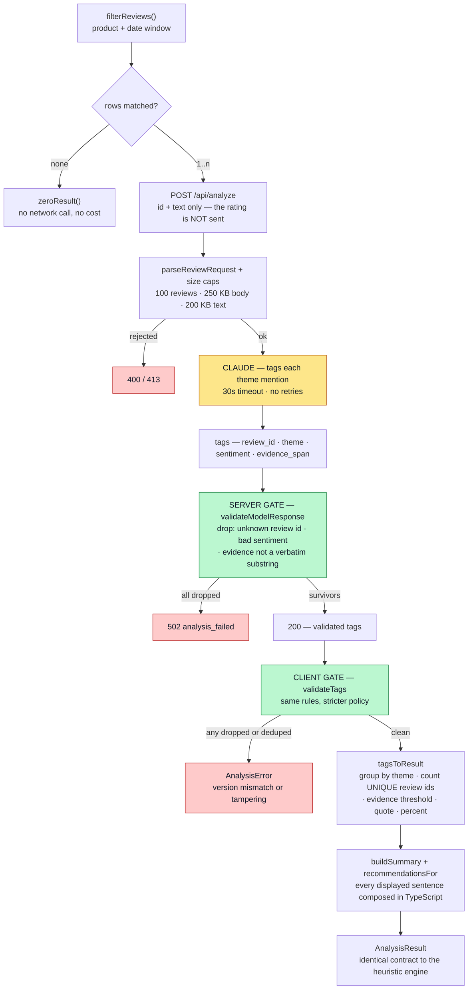

# ReviewIQ

**Live demo (GitHub Pages, heuristic) → https://amina-moufakkir.github.io/ReviewIQ/**

**Vercel (same-origin app + `/api`) → https://reviewiq-six.vercel.app/**

> The public demo uses a small **synthetic Amazon-style dataset**, so the full
> integration can be explored without redistributing the original data. Local
> developers can download the real dataset and run `npm run build:amazon` to
> replace it. See [Getting the dataset](#getting-the-dataset).

## In short

ReviewIQ helps E-commerce Analysts understand customer feedback fast: it turns
raw reviews into a structured product brief — what customers praise, what they
fault, the recurring themes, and what to do next — with every claim backed by
counts and a real quote from the selected rows.

It runs **two interchangeable analysis engines** — a deterministic heuristic one
and a Claude-powered semantic one — behind a single `analyzeReviews()` contract,
over **three data sources**: a real Amazon product dataset, a synthetic review
sample, and any CSV you upload. Those sources do not share a data model — an
Amazon row is a product record, a sample row is one customer's review — so the
engineering problem the project actually solves is holding one loader, one
contract and one UI steady while the shape of the underlying data changes.

## Problem

Customer insights are buried in thousands of reviews. Analysts spend hours reading and summarizing feedback before they can answer business questions.

## MVP

The core MVP is complete. An analyst can:

- Use the **real Amazon product dataset** (the default), the built-in sample,
  load the bundled 204-review sample, or **upload a CSV** — either a ReviewIQ
  review CSV or a raw Amazon product export, recognized by its header
- Select a product
- Select a date range (for datasets that carry review dates)
- Run the analysis
- View a structured brief: overall summary, what customers praise, what they
  fault, recurring themes, and recommended actions
- See a **discounts & promotions** breakdown when the data supports it —
  how promoted purchases compare with full-price ones on average rating

Every insight — findings, mention counts, percentages, representative quotes,
and the summary — is derived only from the rows inside the selected product
and, where the data carries review dates, the selected date range. The Amazon
dataset has no dates, so a run there covers every product record for the chosen
product.

## Two data models, one contract

ReviewIQ deliberately supports two kinds of row, and names them differently
rather than forcing one vocabulary over both:

- **Review datasets** (the built-in sample, the 204-review sample, an uploaded
  review CSV) are analyzed **review-by-review**: one row is one customer's
  review, with that customer's own star rating and, usually, a date.
- **Amazon datasets** (the bundled dataset, or an uploaded Amazon export) are
  analyzed **record-by-record**: one row is a product listing that already
  aggregates many customers — a product-average rating and roughly eight
  customers' review text concatenated into a single cell, with no date anywhere
  in the source.

Either model can arrive by upload: the [CSV upload](#csv-upload) control reads
the file's header and routes it to the matching loader, so the model follows the
data rather than the button it came through.

The distinction is load-bearing, not cosmetic. It decides the noun the UI uses
("1,464 product records", never "1,464 reviews"), whether the date window is
shown at all, and how much a percentage is really claiming. `unitFor()` in
`src/lib/datasetInfo.ts` is the single place that decision is made; everything
downstream reads it. See [What one row actually is](#what-one-row-actually-is)
for what this costs analytically.

## CSV upload

Upload a CSV and ReviewIQ analyzes it in place — no backend, nothing sent to a
server. **One control accepts both supported shapes**, and the file's own header
decides how it is read:

| Your file's header carries | It loads as | One row is |
| --- | --- | --- |
| `review_id`, `product_id`, `product_name`, `category`, `rating`, `review_text` | a **ReviewIQ review CSV** | one customer's review |
| `product_id`, `product_name`, `category`, `rating`, `review_content` | an **Amazon product export** | one product record |

So a raw Amazon export — the 16-column source file, unmodified — can be dropped
straight into the upload control, and it loads exactly as the bundled Amazon
dataset does: product records, undated, counted and worded as records
(1,465 parsed → 1,464 accepted → 1,350 products, for the full source file).
There is no separate Amazon upload button, and no need to run
`npm run build:amazon` first — that script exists to make the dataset the app's
*default* source, not to make it uploadable.

Detection reads column names only — no value sniffing, no filename heuristics —
so two files with the same header always load the same way. A file that carries
both `review_text` and `review_content` is read as the ReviewIQ shape, which
keeps per-customer rows per-customer. A file matching neither is rejected with a
message naming what each shape is missing, rather than a guess:

> This CSV matches neither supported format. As a ReviewIQ review CSV it is
> missing review_id, review_text; as an Amazon product export it is missing
> review_content.

Both routes converge on the same loader, so validation, skip reasons and the
parsed/accepted/skipped accounting are identical either way
(`src/lib/loadUploadedCsv.ts`).

### Review-CSV columns

Required: `review_id`, `product_id`, `product_name`, `category`, `rating` (1–5),
`review_text`. Optional: `review_date`, `review_title`, `verified_purchase`,
`country`, `promotion`, `discount_percent`. See
[`public/sample-reviews.csv`](public/sample-reviews.csv) for the exact format.

`review_date` is the one optional column that changes how the dataset behaves:

- **Present** — every row must hold a valid calendar date (`YYYY-MM-DD`). Rows
  with a **strictly-invalid** one (e.g. `2026-02-30`, `2026-13-01`, or a blank
  cell) are skipped and counted, and the date range auto-fits the data.
- **Absent** — the file is treated as **undated**. Every row loads with no date
  and the date window is hidden rather than shown empty; a run covers every row
  for the chosen product. This is how the Amazon dataset loads.

Rows with an out-of-range rating or a duplicate id are skipped and counted
either way.

Parsing is entirely in the browser: the file itself is never uploaded anywhere,
under either engine. The heuristic engine then analyzes it in the browser too,
so nothing leaves the page at all. The Claude engine sends the **filtered**
reviews — the selected product, and the date window when the data has one — to
`/api/analyze`; see [Security model](#security-model).

## How the analysis works

ReviewIQ has **two analysis engines** behind a single async boundary,
`analyzeReviews()` in `src/services/analyzeReviews.ts`. The UI and the
`AnalysisResult` contract are identical no matter which engine runs — only
the engine that produces the tags changes. Selection is by configuration
(`VITE_ANALYSIS_ENGINE`), not a user-facing toggle.

The heuristic engine was built **first, on purpose**: it is explainable,
testable, free to run, and deterministic, so the whole product — filtering,
evidence, thresholds, quotes, UI — could be proven correct without a model in
the loop. The Claude engine was added behind the same boundary afterwards.
[Why the second engine exists](#why-the-second-engine-exists) is where the
interesting part is: the Amazon dataset makes the difference between them
measurable rather than theoretical.

No backend, database, or accounts are required for either engine's data: rows
come from the Amazon fixture, the built-in sample, or a CSV you provide, and are
parsed entirely in the browser.

### Which engine for which data

ReviewIQ chooses its sentiment method by the **shape of the data**, because the
two are not interchangeable.

**Rating-based sentiment (heuristic engine)** infers praise/fault from the star
rating. It is fast, free, deterministic and offline — it powers the GitHub Pages
demo, which has no server to call — and it is a good approximation whenever a
review's overall verdict matches its parts.

Its limit is **structural, not a matter of tuning**. Polarity is read from the
review's rating and applied to every theme that review mentions
(`mentioning.filter(r => r.rating >= 4)`), so a single review cannot split: it is
all praise or all fault. A review that likes one aspect and dislikes another is
therefore misfiled, and the built-in sample already contains such reviews:

> 2★ *"Kept dropping connection during video calls. When it works the sound is
> genuinely good."* — Sound quality and Connectivity are **both** filed as
> faults, though the sound is explicitly praised.

> 4★ *"Delicious espresso and easy to froth milk. Cleaning takes effort but the
> results are worth it."* — Coffee quality and Cleaning are **both** filed as
> praise, though Cleaning is the complaint.

A second blind spot follows from the same design: keyword matching has no notion
of negation, so *"no problems with the battery"* inside a low-rated review counts
as battery-fault evidence.

So the accuracy claim is bounded. On per-review data the engine is right about
most reviews, because most reviews are not mixed, and wrong about the mixed ones
in proportion to how many there are. On product-average data it fails
completely — one "review" is thousands of customers at once, and a single star
value describes none of them individually.

**Text-based sentiment (Claude engine)** reads the review body and assigns
sentiment **per theme mention**, which is the difference that matters: one review
can yield praise for one theme and a fault for another, because each mention is
judged on its own words rather than inheriting a verdict from the row. That is
the case the rating-based engine cannot represent at all.

It is required for data where the rating does NOT track individual reviews — the
Amazon dataset, whose rating is a product-AVERAGE over thousands of customers.
There a rating-based engine goes blind: a complaint written inside a 4- or
5-star review, or inside an averaged 3-star record, is invisible to it. The
Claude engine surfaces it because it reads the words. The average rating is shown
only as CONTEXT in the header — labelled an averaged product rating — and never
determines sentiment. It is not sent to the model at all.

A worked example, `7SEVEN Compatible LG TV Remote` (`B09F6D21BY`), one product
record whose average is 3.0★. The heuristic engine returns no praise and no
faults: a rounded 3 is neither ≥ 4 nor ≤ 2, so no text in that record can
produce a finding. The record actually reads:

> The mouse feature of the remote is not working … no voice recognition and no
> ray pointer … would like a refund for misrepresentation on the website …
> Number buttons are not working, Defective product, it is not working with the
> tv …

The Claude engine surfaces those as faults, each quoted verbatim from that text.

**The rule:** match the engine to the data shape, and know what each costs.
Rating-based sentiment is a reasonable approximation when one rating stands for
one review's whole text, and it buys determinism, zero cost and offline
operation for the price of getting mixed reviews wrong. When the rating stands
for an average of many, that price becomes the whole answer: derive sentiment
from the text and demote the rating to displayed context. The `analyzeReviews()`
boundary lets both engines coexist so the right one runs for the right data.

**Where this is verified, and where it is not.** The Claude engine is verified
**locally only**, via `VITE_ANALYSIS_ENGINE=claude vercel dev`. It is **not
enabled on the live Vercel deployment**, which runs heuristic-only: the
production bundle is built without `VITE_ANALYSIS_ENGINE=claude`, so the Claude
path and its `/api/analyze` call are tree-shaken out of the shipped JavaScript
entirely. That deployment also cannot reach the real dataset — `.vercelignore`
excludes `public/amazon-products.csv`, because its redistribution terms are
unverified and `src/amazon.csv` additionally carries real reviewer ids and
names — so it falls back to the synthetic `amazon-demo.csv`. The live site
therefore demonstrates the rating-based engine over synthetic product records;
the text-based engine over real ones is a local capability. The UI states which
engine produced any given result rather than leaving a reader to assume.

**This is a settled decision, not a gap.** The live site stays heuristic-only
and the Claude engine stays a locally verified capability. Three things drove it:
the per-analysis API cost; the real dataset's unverified redistribution terms and
reviewer PII, which keep it out of deployments regardless of engine; and an
`/api/analyze` that has no authentication and would be publicly reachable through
the production alias. `ANTHROPIC_API_KEY` is therefore set in **no** Vercel
environment, and the deployed endpoint answers `500 server_misconfigured` by
design — see [Secret configuration](#secret-configuration-local-only).

Read an empty Vercel environment as the decision working, not as something to
repair.

**Determinism is the trade-off.** The heuristic engine is fully deterministic —
identical input yields identical output — which is what makes it reproducible,
unit-testable, and safe to assert on in CI. The Claude engine's theme
*clustering* varies between runs. The same complaints surface and the quotes
stay verbatim, but the model may group equivalent mentions into a different
number of named themes, so per-theme counts are not reproducible run to run the
way the heuristic engine's are.

Observed on `B09F6D21BY`, same text, two consecutive runs: 7 faults / 2 praise,
then 5 faults / 3 praise — the second run merged "ray pointer missing" and
"voice recognition" into one theme. Every quote was an exact substring of the
review text in both runs.

Grounding is unaffected by this, and that is the point: what varies is how
findings are *named and grouped*, never whether they trace to words a customer
actually wrote. The evidence check in `claudeTags.ts` is a code-level gate, not
a model instruction, so it holds regardless of how the model clusters. This
variance is a property of using a language model, not a defect to engineer away
— no temperature or seed tuning is applied to suppress it. Assert on grounding
in tests, not on theme counts.

### Engine 1 — Heuristic (default, no backend, fully static)

A deterministic, rating-assisted engine (`src/services/analysisEngine.ts`)
that runs entirely in the browser with no API calls. It:

- **detects themes** by whole-word / bounded-phrase keyword matching against a
  shared vocabulary (`src/services/themeLibrary.ts`, `src/lib/matchKeyword.ts`),
  so `cleaner teeth` does not trigger `Cleaning`;
- **decides sentiment from the star rating** — ≥ 4 is praise, ≤ 2 is a fault,
  3 is neutral;
- only surfaces a theme once enough same-polarity rows support it, and always
  attaches a real supporting quote. **How many rows is "enough" depends on what
  a row is** (`minEvidenceFor`): **two** for review data, because the threshold
  exists to stop one customer's passing remark becoming a theme — but **one**
  for product records, because a single record already bundles roughly eight
  customers behind a rating averaged over thousands. Requiring two records would
  require the same product to be listed twice on the marketplace, which is a
  property of marketplace listings, not of evidence. A product-level finding
  therefore claims the theme is *mentioned* in that record, and the UI says
  "Themes mentioned" rather than "Recurring themes", and omits the percentage
  when there is only one row (1 of 1 is 100%, which reads as unanimity);
- adds a **discounts & promotions** breakdown (`src/services/promotionAnalysis.ts`)
  when the reviews carry promotion data — comparing promoted vs full-price
  purchases on average rating; datasets without it simply omit the section.

Each finding's percentage is that theme's supporting rows as a share of the rows
in the selected product and window ("N of M selected reviews · P%", or "product
records" for undated product-level data such as the Amazon dataset).
Because it needs no server, this engine powers the static **GitHub Pages demo**,
and it is deterministic — the same input always produces the same output.

### Engine 2 — Claude (semantic, server-side)

A Claude-powered engine that understands the actual language of the reviews
rather than matching a fixed keyword list. It:

- identifies themes from the reviews' own wording and clusters semantically
  equivalent phrasings under one canonical label (e.g. "died after a week",
  "won't hold a charge", "battery's useless" → one battery-life theme);
- assigns sentiment from the **review text**, per theme mention — so a 4-star
  review that contains a real complaint is correctly counted as a fault;
- returns only structured tags; **all counts, percentages, and quotes are still
  computed in TypeScript from the real reviews** — never taken from model prose.

So the summary sentence and every number are computed in code under **both**
engines; what the Claude engine changes is *how themes and per-mention sentiment
are detected* (language understanding vs. a fixed keyword list + star rating).

#### The pipeline

The model is the only nondeterministic component in the system, and it is
sandwiched between deterministic validation and deterministic assembly. It
proposes; code disposes.



Three properties are worth reading off the diagram:

- **The rating never reaches the model.** It is absent from the request, so
  sentiment cannot be influenced by it — a structural guarantee rather than an
  instruction the prompt asks the model to follow.
- **The evidence check is a code gate, not a prompt rule.** Theme naming and
  clustering vary between runs; whether a claim is allowed to appear does not.
  Measured across three runs on identical text: different groupings each time,
  zero ungrounded quotes every time.
- **The second gate is stricter than the first by design.** The server is
  lenient toward an untrusted model — it keeps valid tags and discards bad ones.
  The client trusts the server, so *any* rejection there means a version
  mismatch or a tampered response, and the whole request fails rather than
  rendering a partial report.

### Why the second engine exists

On ordinary review data the two engines are close: one row is one customer with
one opinion and one star rating, so deriving sentiment from the rating is a
reasonable approximation and the heuristic engine produces a useful brief.

The Amazon dataset is where that approximation breaks, and it breaks
*measurably*. Each row's rating is a product **average** over thousands of
customers, so it regresses toward the middle: across the 1,464 accepted records,
1,422 round to ≥ 4 and exactly **2** round to ≤ 2. The heuristic engine reads
sentiment from that number, so it has almost no fault evidence to find — the
"what they fault" column comes back near-empty not because the products have no
problems, but because averaging destroyed the signal the engine depends on. The
complaints are still there, in the text, in the same rows.

The Claude engine reads that text, and assigns sentiment per theme *mention*
rather than per row, so a record whose rounded rating says 4 can still yield a
fault. **The dataset itself is the argument for semantic analysis** — not a
preference for models over rules, but a data shape a rating-based heuristic
structurally cannot answer, whatever its keyword list. Swapping the source is
what exposed it, which is precisely why both engines sit behind one contract.

(The heuristic half of that comparison is measured — 1,422 vs 2 is counted
directly from the accepted records. The Claude half is a property of how the
engine assigns sentiment, verified end-to-end on review data; a fixed evaluation
set on the Amazon data is the benchmark still deferred below.)

### Security model

The Claude call runs **server-side only**, in a Vercel serverless function at
`api/analyze.ts`. The `ANTHROPIC_API_KEY` lives only in the server environment
(a Vercel Environment Variable), is never bundled into the browser, and is never
prefixed `VITE_`. The browser sends the filtered reviews to `/api/analyze` and
receives back validated tags or a controlled error.

### Selecting an engine

Set `VITE_ANALYSIS_ENGINE` in the environment:

| Value       | Engine    | Where it runs                        |
| ----------- | --------- | ------------------------------------ |
| `heuristic` | Engine 1  | Browser only (GitHub Pages demo)     |
| `claude`    | Engine 2  | Vercel (`api/analyze.ts`) + browser  |

`VITE_ANALYSIS_ENGINE` carries only the engine name — it is **not** a secret and
contains no key. When Claude mode is selected and the call fails, the app
surfaces a controlled error; it does **not** silently fall back to the heuristic
engine.

For the Claude engine's endpoint behavior, request limits, secret configuration,
`vercel dev`, deployment, and cost, see
[Claude engine & Vercel deployment](#claude-engine--vercel-deployment) below.

## Amazon dataset (the default data source)

On load, ReviewIQ analyzes the **Amazon Sales Dataset** — approximately 1,465
real Amazon product listings. It is fetched at runtime from
`public/amazon-products.csv`, parsed by the same RFC 4180 parser and validated
by the same loader as any uploaded CSV, and adapted by
`src/lib/amazonAdapter.ts`.

> **The real dataset is not committed to this repository — you supply it
> locally.** Nothing derived from it is redistributed here, on purpose. See
> [Source, licence and attribution](#source-licence-and-attribution) for why,
> and [Getting the dataset](#getting-the-dataset) for how to supply it.

**The Amazon source resolves in this order:**

1. `public/amazon-products.csv` — the real dataset, generated locally by
   `npm run build:amazon`.
2. `public/amazon-demo.csv` — a committed, fully **synthetic** stand-in in the
   same column shape. This is what deployed builds get.

The fallback is deliberately to synthetic *Amazon-shaped* data and never to the
ordinary review sample: someone exploring the Amazon path should actually be
exercising the Amazon adapter, not a different dataset wearing its name. The
label reads "Amazon demo records (synthetic)" and the app states in place that
the records are invented, so the two can never be confused. The built-in sample
and CSV upload remain separately selectable either way.

Everything the integration does stays visible on the demo data: the adapter
runs, records are undated, the wording says *product records*, the long-title
selector shortening applies, and the parsed/accepted/skipped accounting has real
skips to show.

### Source, licence and attribution

The dataset is the **Amazon Sales Dataset** by KARKAVELRAJA J, published on
Kaggle at
<https://www.kaggle.com/datasets/karkavelrajaj/amazon-sales-dataset>, where it
is tagged **CC BY-NC-SA 4.0**. Approximately 1,465 product listings; this
repository's figures (1,465 parsed → 1,464 accepted → 1,350 products) come from
that file.

**Nothing derived from it is redistributed here** — not the raw file, not the
generated fixture, not an excerpt. That is deliberate, and it is stricter than
the tag alone would require.

The reason is that a Kaggle licence tag is chosen by the **uploader**, and an
uploader can only license rights they hold. The review text here was written by
Amazon customers, and Amazon's terms restrict scraping and redistribution of
site content, so the tag governs at most the uploader's compilation — it cannot
grant rights over the underlying reviews. Rather than decide how far it reaches,
this project treats redistribution as not permitted and never tests the
question. ShareAlike never triggers, because SA applies to *distributing* an
adaptation and no adaptation is distributed. The non-commercial term is likewise
never exercised.

Attribution is given anyway, because published **results** are derived from the
data even though the data is not published: record counts, the rating
distribution, and the worked example in
[Why the second engine exists](#why-the-second-engine-exists).

Independently of licensing, the raw file carries **real reviewer ids and names**
— see [Getting the dataset](#getting-the-dataset) for the counts and for what
the generator strips. That is a privacy constraint, not a licence one, and it
would apply even under a permissive licence.

*This is a description of the project's own policy, not legal advice.*

### Why the deployed build ships synthetic data

The synthetic dataset is a **design decision, not a fallback of last resort**.

The constraint was identified first: the data cannot be redistributed and
carries personal identifiers. The available responses were to drop the Amazon
integration, to deploy a crippled version of it, or to build a stand-in that
exercises the identical code path. The third was chosen, so
`public/amazon-demo.csv` is invented from scratch **in the source's exact column
shape** — which is why the deployed demo still runs the real adapter, still
produces undated product records, still says *product records* rather than
*reviews*, and still has genuine skips in its load accounting.

The boundary is enforced mechanically rather than by convention, because a rule
that depends on remembering it is not a rule:

| Mechanism | What it stops |
| --- | --- |
| `.gitignore` | the raw file and the generated fixture entering the repository |
| `.vercelignore` | either file reaching a deployment — `vercel deploy` uploads the working directory, not the git tree, so `.gitignore` alone would not have caught this |
| `scripts/build-amazon-csv.mjs` | reviewer ids and names surviving into the generated fixture |

The two are labelled differently wherever they appear. The demo dataset loads as
"Amazon demo records (synthetic)" and the app states in place that the records
are invented, so a visitor cannot mistake generated text for customer feedback.

The cost is honest and worth stating: the deployed demo cannot demonstrate the
finding that motivates the second engine, because that finding needs real
reviews. The README carries it instead, with the numbers.

### What one row actually is

**One row is a product record, not a customer review.** Each row is a product
listing that carries a product-average rating and the review text of roughly
eight customers concatenated into a single cell. Everything the app reports
about this dataset therefore counts *product records*, and the UI says so —
it never labels them "reviews".

### Load accounting

| | |
| --- | --- |
| Parsed records | 1,465 |
| Accepted | 1,464 |
| Skipped | 1 (`invalid_rating` — one row whose `rating` cell is `\|`) |
| Products derived | 1,350 |

The app shows the first three verbatim: *1,465 parsed · 1,464 accepted · 1
skipped (invalid rating 1)*, above *Using Amazon product records · 1,464 product
records · 1,350 products*.

**Why 1,465 rows become 1,350 products.** Rows and products are not the same
count, for two independent reasons:

1. The 1,465 parsed rows carry **1,351 distinct `product_id`s**. 92 of those ids
   appear on more than one row, with differing prices, rating counts and text.
   Rows are never deduplicated; a product is derived from the **first** accepted
   row per id, so repeated ids collapse to one product each.
2. One row is skipped (`rating` cell is `|`). Its `product_id` appears on **no
   other row**, so that id is lost with it — leaving **1,350 distinct ids across
   the 1,464 accepted rows**, and therefore 1,350 products.

So: 1,351 distinct ids − 1 id whose only row was invalid = 1,350 products; the
92 repeated ids explain the gap between 1,464 accepted rows and 1,350 products,
not the 1,351/1,350 difference. (The 92 figure is the same before and after the
skip.)

`accepted + skipped = parsed` always holds, every skip is attributed to a
reason, and both numbers are shown in the app. No row is discarded silently.

### Mapping

| Amazon column | ReviewIQ field | Transformation |
| --- | --- | --- |
| `product_id` | `Review.productId`, `Product.id` | trimmed |
| `product_name` | `Product.name` | trimmed |
| `category` | `Product.category`, `Review.category` | `\|` hierarchy split; leaf used, full path preserved in `AmazonRecord.categoryPath` |
| `review_content` | `Review.text` | **verbatim — never split on commas** |
| `rating` | `Review.rating` + `Review.sourceRating` | rounded to an integer; source decimal preserved |
| *(none)* | `Review.date` | `""` — the dataset has no dates and none are invented |
| *(synthetic)* | `Review.id` | positional `amz-0001`… |
| `discounted_price`, `actual_price`, `discount_percentage`, `rating_count` | *(not used for analysis)* | `₹`, `,` and `%` stripped into numbers; raw strings kept in `AmazonRecord.raw` |
| `user_id`, `user_name`, `about_product`, `img_link`, `product_link`, `review_id`, `review_title` | *(dropped)* | see below |

### Analytical limitations

These are properties of the data, not bugs. They are stated in the app as well
as here, because technical compatibility is not analytical validity.

- **Rounded ratings.** Amazon ratings are product-average decimal ratings.
  ReviewIQ currently requires integer ratings (1–5). The adapter rounds the
  average rating to the nearest integer for compatibility while preserving the
  original decimal value in `Review.sourceRating`. *This is a compatibility
  transformation, not a claim that the average rating was originally an
  integer.* Rounding is not optional: the loader rejects non-integers, and so
  does the `/api/analyze` request contract, and neither may be modified.
- **One record per product, mostly.** 1,258 of the 1,350 products have exactly
  one record (70 have two, 22 have three). This is why the evidence threshold is
  per-unit: at two rows, 93% of products could not produce a theme *in
  principle*, and only 83 products reported anything at all. At one row, 1,149
  do. Read a finding accordingly — it rests on one record's bundled text, not on
  agreement between records.
- **Praise/fault skew.** The heuristic engine treats `rating >= 4` as praise
  evidence and `rating <= 2` as fault evidence. On this data that is 1,422
  records versus 2 — an artifact of averaging thousands of customers into one
  number, not a finding about the products. **The evidence threshold does not
  fix this**: with one-record evidence, praise appears for 1,149 products but
  faults for 1, and recommendations (which derive from faults) stay empty for
  1,349 of 1,350 products. A rating-driven engine cannot find complaints in data
  whose ratings are product averages. The Claude engine reads the text instead,
  surfaces the faults, and therefore produces the recommended actions too — see
  [Why the second engine exists](#why-the-second-engine-exists). Both engines
  say so in the UI: an empty Recommendations section under the rating-based
  engine states that complaints were not *detected*, never that there are none.
- **No dates.** The dataset has no date field of any kind. No date is invented,
  derived, or substituted — records are undated (`date: ""`), and the date
  window is hidden rather than shown empty or pre-filled.
- **Counts are records, not customers.** `reviewCount`, mention counts and
  percentages are shares of product records. `user_id` is a comma-joined list of
  several people and is **never** used as a row key or a customer count.
- **Quotes are drawn from bundled text.** A representative quote comes from a
  cell that concatenates several customers, so it is one person's sentence
  attributed to a record covering many. Some records also embed image URLs
  mid-text.
- **Repeated products.** 92 `product_id`s appear on more than one row, with
  differing prices, counts and text. Rows are not deduplicated; products are
  derived from the first accepted row per id, so a product's *name* and
  *category* come from one listing while its records span all of them. See
  [Load accounting](#load-accounting) for how this produces 1,350 products from
  1,464 records.
- **Currency is ₹ (INR).** Prices are Indian rupees; nothing in the app presents
  them as any other currency.
- **No promotion insight.** `discount_percentage` is a *listing* discount, not a
  promotion the reviewer purchased under, so it is deliberately not mapped to
  `Review.discountPercent` and the promotions panel stays hidden for this data.

### Getting the dataset

Neither the raw source nor the generated fixture is committed. Both are
gitignored and supplied locally:

| Path | What it is | Committed? |
| --- | --- | --- |
| `src/amazon.csv` | raw source, 16 columns, ~4.5 MB — **you download this** | no |
| `public/amazon-products.csv` | generated, 9 columns, ~2.3 MB — preferred at runtime | no |
| `scripts/build-amazon-csv.mjs` | the deterministic generator | **yes** |
| `public/amazon-demo.csv` | 29-row synthetic dataset (25 accepted, 4 deliberate skips → 24 products) — what deployed builds serve | **yes** |
| `src/test/fixtures/amazon-mini.csv` | 12-row synthetic fixture — tests only | **yes** |

The two synthetic files are invented in the same style but serve different
purposes and are edited independently: `amazon-demo.csv` supports the deployed
product, `amazon-mini.csv` supports the tests. Application code never imports
from `src/test/fixtures/` — that directory stays test-only.

Two reasons nothing derived from the dataset is published here:

1. **Licence.** The source is the *Amazon Sales Dataset* on Kaggle, tagged
   CC BY-NC-SA 4.0 by its uploader. Redistribution is treated as not permitted
   regardless of that tag, for the reasons in
   [Source, licence and attribution](#source-licence-and-attribution). If the
   position on redistribution ever changes, the generated fixture can be
   committed with the attribution the terms require — nothing else in the setup
   needs to change.
2. **Personal data.** The raw file's `user_id` and `user_name` columns are
   comma-joined lists holding 11,503 identity tokens — **9,050 distinct
   reviewer ids** (and 7,698 distinct names). The generator drops them (along with unused
   bulk: `about_product`, `img_link`, `product_link`, `review_id`,
   `review_title`), so the generated fixture carries no personal identifiers —
   but it is still derived from the source, so rule 1 governs it too.

To set it up:

```bash
# 1. Download the Amazon Sales Dataset CSV and save it, unmodified, as:
#      src/amazon.csv
# 2. Generate the fixture the app fetches:
npm run build:amazon        # src/amazon.csv → public/amazon-products.csv
```

The CSV is never hand-edited — re-run the script instead. It is a physical
projection only: it drops columns and copies every cell it keeps verbatim, so
all normalization and interpretation stay in the runtime adapter. The fixture is
served from `public/` and fetched at runtime, so it adds nothing to the JS bundle.

Step 2 is what makes the dataset the app's **default** source. To simply look at
the data, it is optional: the downloaded `src/amazon.csv` can be uploaded
through [CSV upload](#csv-upload) as-is, and loads through the same adapter with
the same accounting. Generate the fixture when you want it on load, every load.

**Without the real dataset**, the app falls back to `public/amazon-demo.csv`
automatically — nothing to configure, and the built-in sample and CSV upload keep
working alongside it. Deleting `public/amazon-products.csv` is enough to see
exactly what a deployed build shows.

See [`src/test/fixtures/README.md`](src/test/fixtures/README.md) for what the
test fixture deliberately contains.

## Sample dataset (for CSV-upload development)

A larger synthetic dataset lives at [`public/sample-reviews.csv`](public/sample-reviews.csv)
(204 reviews across 6 products and 5 categories). Load it in the app with
**"Load 204-review sample"**, or upload your own CSV in the same format. It offers
far more variety than the small built-in sample.

Columns:

| Column | Description |
| --- | --- |
| `review_id` | Unique ID, e.g. `hp-0001` |
| `product_id` | Stable product key, e.g. `headphones-01` |
| `product_name` | Display name |
| `category` | Electronics, Kitchen Appliances, Wearables, Home Office, Personal Care |
| `review_date` | ISO date, `YYYY-MM-DD` |
| `rating` | Integer 1–5 |
| `review_title` | Short title |
| `review_text` | Review body |
| `verified_purchase` | `true` or `false` |
| `country` | Short code (US, UK, CA, AU, NZ, IE) |
| `promotion` | *(optional)* Promotion/discount label, e.g. `Spring Sale` |
| `discount_percent` | *(optional)* Discount applied, 0–100 |

It is deliberately designed to exercise product/date filtering, recurring
themes, evidence-backed findings, representative quotes, uneven review volume,
and small vs. large result sets. It also embeds intentional patterns — a
product whose sentiment improves over time, one that worsens, and a temporary
complaint spike in a specific date range.

> **This is synthetic sample data, not real customer reviews.** It is intended
> only for product testing and CSV-upload development, and must not be presented
> as, or mistaken for, genuine customer data.

## Claude engine & Vercel deployment

The optional **Claude engine** uses the Claude API as a *semantic tagging layer*
(not a report generator). For the filtered reviews (selected product, plus the
date range when the data has one) it identifies specific themes from the
language, clusters equivalent
descriptions under one canonical label, and assigns sentiment per theme mention
with the exact supporting text span. **All counts, percentages, thresholds, and
the summary are still computed in TypeScript** — the model judges language, code
computes evidence. Star ratings are passed only as context and never determine
sentiment.

### Architecture (same-origin, key stays server-side)

- **Server function:** [`api/analyze.ts`](api/analyze.ts) is a Vercel serverless
  function. The browser calls it at the relative, same-origin path
  **`/api/analyze`** (so there is no CORS to configure). It receives the filtered
  reviews, calls Claude, validates the response, and returns **only** the
  validated tag payload or a controlled error — never raw provider output.
- **Client engine:** [`src/services/claudeEngine.ts`](src/services/claudeEngine.ts)
  posts to `/api/analyze` and **defensively re-validates** the response before
  building an `AnalysisResult` (two gates: server and client).
- The **`ANTHROPIC_API_KEY` never reaches the browser.** It is read only via
  `process.env` inside the function, is never prefixed `VITE_`, and is never
  committed. A Claude failure surfaces through the normal error UI and **never**
  silently falls back to the heuristic engine.
- **Limits (server-enforced):** at most **100 reviews** and ~**250 KB** request
  body per request, plus a post-parse review-text budget; over-limit returns a
  controlled `413` (never truncated). Model default is `claude-opus-4-8`
  (override with `ANTHROPIC_MODEL`); the Claude call has a ~30s timeout.

### Local development (`vercel dev`)

`npm run dev` (plain Vite) does **not** serve `/api` and does not load the Vercel
environment — use it only for the heuristic engine. For anything touching the
Claude engine, use the Vercel CLI's linked-project workflow:

```bash
npm i -g vercel          # once
vercel link              # link this dir to the Vercel project (creates .vercel/, gitignored)
vercel dev               # runs the frontend + /api together, loads Dev env vars
```

To exercise the Claude engine locally, run with `VITE_ANALYSIS_ENGINE=claude`.

**Where the key must live for `vercel dev`:** in your shell, exported from
`.env.local` — not in any Vercel environment, including Development. A local
`.env.local` feeds the **frontend/build** but is **not** injected into the
function runtime, so the function returns the controlled
`500 server_misconfigured` unless you export it first. See
[Secret configuration](#secret-configuration-local-only) for the exact command.

### Secret configuration (local only)

`ANTHROPIC_API_KEY` lives in your local `.env.local` and **nowhere on Vercel**.
Copy [`.env.example`](.env.example) — it lists only `ANTHROPIC_API_KEY=`, and
local `.env*` files are gitignored. `vercel dev` does not reliably pick the key
up from `.env.local` on its own; export it into the process instead:

```bash
set -a && . ./.env.local && set +a
VITE_ANALYSIS_ENGINE=claude ANTHROPIC_API_KEY="$ANTHROPIC_API_KEY" vercel dev
```

Do **not** add the key to any Vercel environment. The deployment is intended to
run heuristic-only, and a configured `/api/analyze` on the production alias would
be an unauthenticated, unrated-limited endpoint that anyone could spend the key
through.

Two things to know if that decision is ever revisited:

- **Removing an env var does not take effect until you redeploy.** A running
  function keeps the environment it was deployed with, so `vercel env rm` alone
  leaves the old build fully functional on the live alias.
- **Past deployments keep their own copy of the secret.** Direct `dpl_` URLs sit
  behind Vercel Authentication (`401`), but a rollback to a keyed build would
  repoint the public alias at it and re-expose the endpoint. Deployments built
  while the key was set have been deleted for that reason.

### Deploy to Vercel

Vercel auto-detects Vite (build `npm run build`, output `dist/`) and auto-deploys
any function under `api/`. Push the branch (or `vercel --prod`) and Vercel builds
the frontend and the function together on the same origin. On Vercel the app is
served at the domain root — `vite.config.ts` sets `base` to `/` automatically
when `VERCEL` is set (and to `/ReviewIQ/` otherwise for GitHub Pages).

### Cost / free-tier notes

Every Claude analysis is one API call over the filtered reviews; input+output
scale with review count (bounded by the 100-review cap). At the default
`claude-opus-4-8`, a large (~100-review) request is roughly on the order of a few
US cents; set `ANTHROPIC_MODEL=claude-haiku-4-5` to cut that substantially. On
Vercel's **Hobby** (free) tier, serverless functions are subject to
execution-time and monthly-invocation limits — fine for a demo, but the Claude
API itself is billed to your Anthropic account regardless of tier.

### Model choice (provisional — benchmark deferred)

The default model is **`claude-opus-4-8`**, overridable per deployment with the
`ANTHROPIC_MODEL` env var. This is a **deliberate but provisional MVP decision**,
not a benchmarked one:

- **Why Opus for now:** it was verified working end-to-end — clean canonical
  theme clustering, correct per-mention sentiment on high-star reviews with real
  complaints, and exact evidence spans. For an MVP the bar is "does it work,"
  which Opus clears.
- **Why it's low-risk to defer optimizing:** the Claude engine runs only in local
  development by decision, so the default model costs nothing in production
  today, and it is a one-line `ANTHROPIC_MODEL` override whenever that changes.
  **`claude-haiku-4-5`** and **`claude-sonnet-5`** are the obvious cost/latency
  candidates.
- **When to revisit:** only if the Claude engine ever carries real traffic, which
  the current decision rules out. At that point, benchmark a
  fixed evaluation set across Haiku / Sonnet / Opus and judge on **canonical
  theme consistency, mixed-sentiment accuracy, evidence-span validity, latency,
  and cost** (evidence-span validity is scored deterministically by the existing
  `validateTags`). That turns the default from an assumption into a measured
  decision against a representative workload — which a small demo eval set can't
  yet stand in for.

### How the two deployments coexist

- **GitHub Pages** — the existing deploy, **heuristic-only** demo. It never sets
  `VITE_ANALYSIS_ENGINE`, so it ships the heuristic engine and never calls
  `/api/analyze`. Unaffected by any of the above.
- **Vercel** — https://reviewiq-six.vercel.app/ — the frontend and the `/api/analyze`
  function on one origin. The engine is env-controlled, and by decision neither
  variable is set there: the deployment ships the **heuristic engine** over the
  synthetic demo records, the Claude path is tree-shaken out of the bundle, and
  the function — still deployed, since anything under `api/` is — answers
  `500 server_misconfigured` because it has no key. Verified after each deploy.
- **Local `vercel dev`** — the only place the Claude engine runs, over the real
  dataset, with the key from `.env.local`.

## Tech

React · TypeScript · Vite · Tailwind CSS · Vitest · Vercel Functions · Claude API

## Scripts

```bash
npm run dev             # start the dev server
npm run typecheck       # tsc
npm run lint            # eslint
npm test                # vitest (engines, CSV parsing, Amazon adapter, product labels, query-bound state)
npm run build           # production build
npm run build:amazon    # regenerate public/amazon-products.csv from src/amazon.csv
```

## Status

✅ Core MVP complete — the real Amazon product dataset as the default source,
CSV upload, and a deterministic heuristic engine, plus an optional
Claude-powered semantic-tagging engine behind the same `analyzeReviews()`
boundary (server-side key, controlled errors, identical UI and
`AnalysisResult`). Engine chosen by `VITE_ANALYSIS_ENGINE`.
